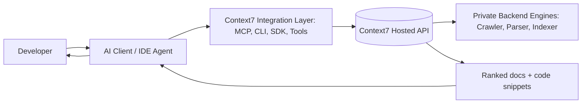
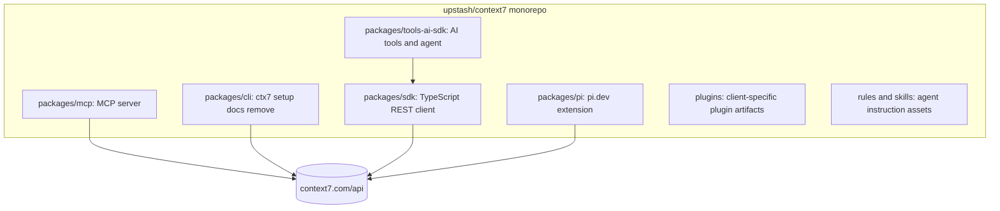
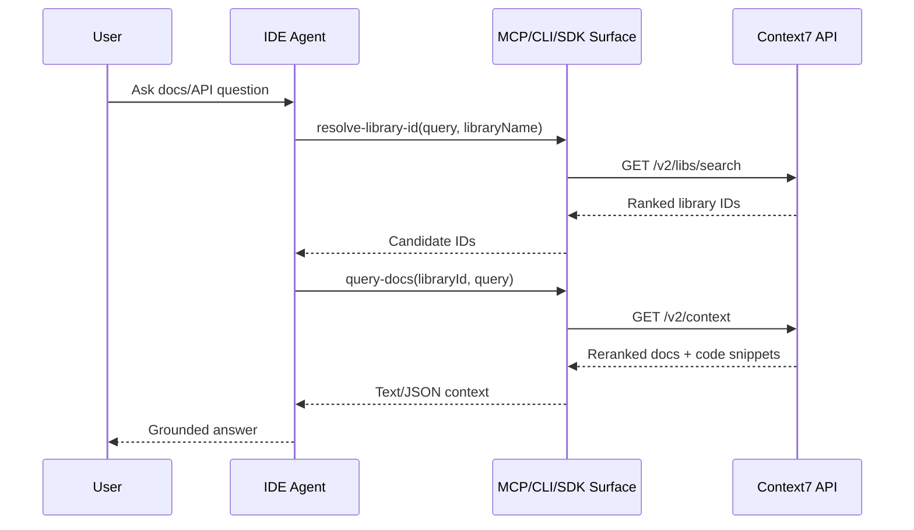
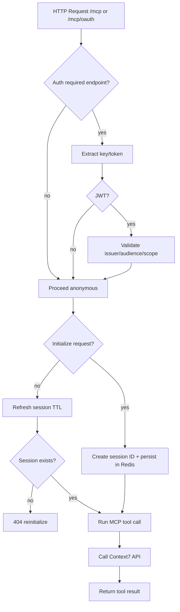
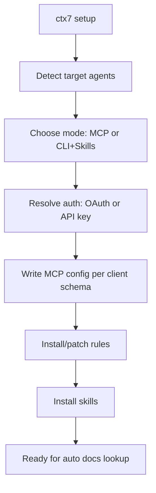
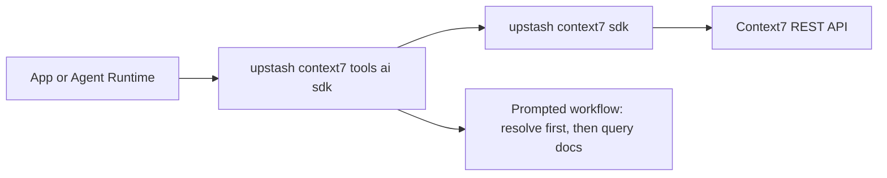
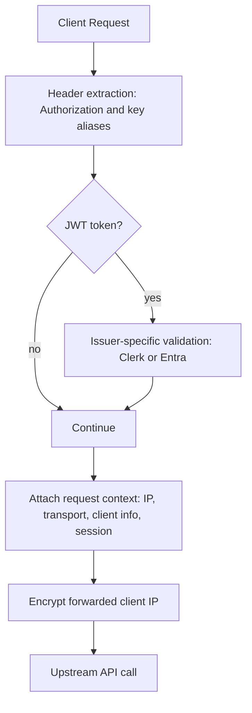

# Context7 Architecture Diagrams (Review Deck Format)

Repository analyzed: https://github.com/upstash/context7

## 1) Executive View

Context7 (open-source repo scope) is an integration layer that routes documentation questions from AI clients to a hosted API.

Key point: the private backend engines are not in this repo; this repo provides the access and delivery surfaces.

## 2) Monorepo Package Map

## 3) Primary Runtime Flow (Resolve -> Query)

Design invariant: every interface converges on the same two-step retrieval contract.

## 4) MCP Server (HTTP Mode) Lifecycle

Operational notes:
- GET on MCP endpoint is intentionally rejected (405).
- Session storage is fail-open for resilience.

## 5) CLI Setup/Provisioning Flow

Client compatibility is encoded as data (per-agent config paths, JSON/TOML keys, and rule placement behavior).

## 6) SDK + Tools Layering

This keeps orchestration policy in tools/prompts while the SDK remains a small typed transport client.

## 7) Security and Identity Signals (Repo-Visible)

Also present:
- OAuth discovery metadata endpoints
- Optional auth nudge signal propagation for anonymous users

## 8) Architecture Strengths

- Unified retrieval contract across all client surfaces
- Strong cross-client install automation in CLI
- Protocol flexibility (stdio + HTTP MCP)
- Resilience features for real-world agent/tool-call behavior

## 9) Gaps and Boundaries

- Parser/crawler/indexing internals are private (not reviewable in this repo)
- Full ranking pipeline and storage internals are inferred only from API contracts/docs

## 10) Slide-Ready Summary

- Context7 repo = integration and delivery plane.
- Hosted API = retrieval and ranking plane.
- Private engines = ingestion/indexing plane.
- Core pattern = resolve library ID, then query docs context.
