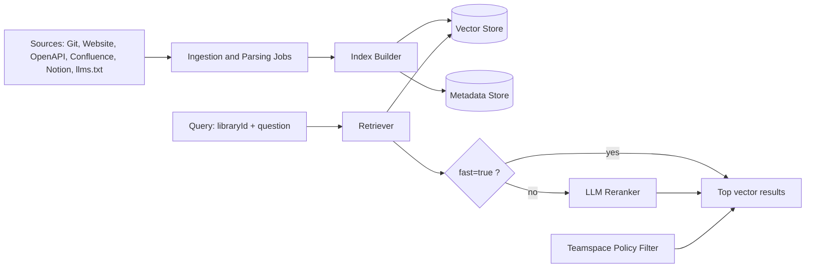

# Context7 Backend Research (Public Evidence)

Scope: What can be learned about the private Context7 backend (parser/crawler/indexer/ranking) from public API/docs and architecture diagrams.

## 1. What Is Confirmed (High Confidence)

### 1.1 Backend capabilities exist behind the API
Public docs and repository README confirm that parsing engine, crawling engine, and core API backend are private components (not open-sourced in the repo).

### 1.2 Ingestion source types are broad
From API and docs, backend ingestion supports:
- GitHub, GitLab, Bitbucket, generic Git
- Websites (crawler, optional base URL scope)
- OpenAPI (URL and upload)
- llms.txt
- Confluence
- Notion

### 1.3 Processing states and lifecycle exist
The public API schema shows library state values:
- `initial`
- `processing`
- `finalized`
- `error`
- `delete`

This indicates an asynchronous backend job lifecycle rather than synchronous ingestion.

### 1.4 Retrieval pipeline includes reranking
`GET /v2/context` is documented as “LLM-reranked documentation context.”
The `fast=true` query option explicitly skips reranking and returns top vector-search results directly. That implies a two-stage retrieval path:
1. Vector retrieval
2. Optional LLM reranking

### 1.5 Vector storage is core
Public privacy docs state indexed content is stored in a secure vector database.
On-prem docs explicitly state local vector storage with no external vector DB requirement.

### 1.6 Update/refresh system is event + popularity driven
“Keeping Libraries Fresh” documents:
- Automatic background refresh triggered on request if stale
- Popularity-tier thresholds:
  - Top 100: 1 day
  - Top 1,000: 15 days
  - Top 5,000: 30 days
  - Others: 45 days
- Website libraries use slightly higher thresholds
- Private libraries are manual-refresh only (not auto-refreshed)

### 1.7 Delta/caching behavior for private source refresh exists
Private source docs indicate refresh charges only changed content and cached pages are free. This strongly implies backend diffing and/or page-level cache reuse in re-parse flows.

### 1.8 Teamspace policy engine gates retrieval globally
Policies API and docs show every search/context request is filtered by teamspace policy:
- Source-type toggles
- Quality filters (trust, verification, recency, stars, website metrics)
- Manual allowlist mode
- Blocked/excepted lists

This indicates a backend authorization/filter layer between retrieval and final response.

### 1.9 Usage observability signals backend telemetry model
Metrics endpoints expose:
- Surface-level request breakdown (web/txt/mcp/cli)
- MCP client unique users by day
- Topic distribution
- Country distribution

This implies backend event aggregation and analytics pipelines tied to library requests.

## 2. Backend Architecture Likely Shape (Evidence-Based Inference)

Below is an inferred architecture, consistent with docs + API contracts + on-prem diagram.

Why this is likely:
- API documents vector path + reranking toggle (`fast`)
- state machine indicates async ingestion
- policies API indicates server-side request filtering
- on-prem diagram shows parser + local DB (kv + vector)

## 3. On-Prem Diagram Signals (Very Useful)

The published on-prem architecture image names these runtime blocks inside a single deployed agent/container:
- local web app
- api server
- parser
- local db (kv + vector)
- external LLM for parser/ranking flows
- private repo ingestion path

This strongly suggests the cloud backend has equivalent logical components, though not necessarily identical deployment topology.

## 4. Security/Privacy-Relevant Backend Behavior

Public docs indicate:
- Query payload is minimized (MCP-formulated query + library identity, not full prompt/code)
- Query text is used for reranking and benchmarking
- API key security includes hashing/encryption at rest
- Infra claims include SOC2-aligned hosting, TLS, and abuse/rate-limit controls
- Data retention windows are documented for API logs and deletion workflows

## 5. What Remains Unknown (Cannot Be Confirmed Publicly)

Not publicly disclosed in implementation detail:
- Exact parser stack and file-type normalization internals
- Queue technology and worker orchestration
- Embedding model selection logic in cloud mode
- ANN/vector index vendor or topology in cloud mode
- Dedup/chunking heuristics and reranker prompt strategy
- Multi-tenant isolation model at data partition level

## 6. Most Practical Mental Model

Treat Context7 backend as three private subsystems behind stable public contracts:
1. Ingestion subsystem: parse/crawl/normalize/chunk/index
2. Retrieval subsystem: vector fetch + optional LLM reranking
3. Governance subsystem: teamspace policy filtering + quotas + analytics

The open-source repo you analyzed implements client-facing access layers (MCP/CLI/SDK/tools), while these three subsystems remain managed/private.

## 7. If You Want Even More Confidence

Practical next steps to reverse-spec behavior (without private code):
- Build a black-box test matrix for `/v2/context` with and without `fast=true` and compare ranking differences.
- Track state transitions over time for newly added libraries using `/v2/libs/search` metadata.
- Measure refresh latency and staleness behavior against popularity buckets.
- Use policies API changes to observe retrieval gating boundaries empirically.
