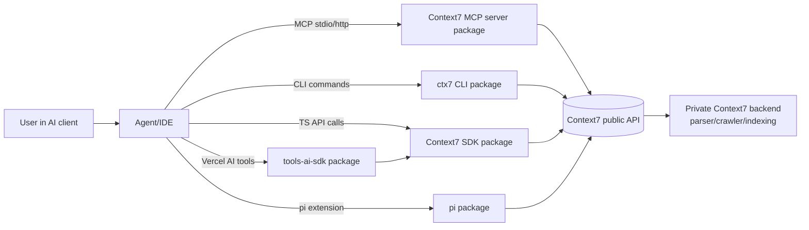
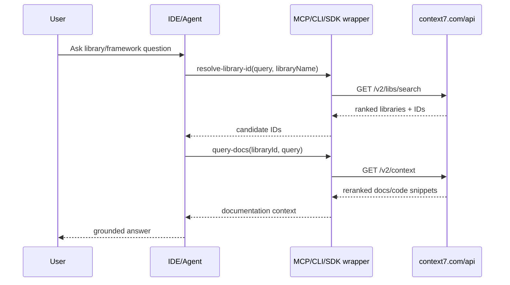

# Context7 Architecture and Design Analysis

Repository analyzed: https://github.com/upstash/context7

## 1. Scope and Important Boundary

This repository is a monorepo for Context7 client-facing surfaces and integration layers, not the full backend.

The code and docs explicitly state that these backend systems are private and not included here:
- API backend internals
- Parsing engine
- Crawling/indexing pipeline

So, the architecture in this repo is primarily a gateway and tooling layer around a hosted Context7 API.

## 2. Monorepo Structure (High-Level)

Context7 is organized as a pnpm workspace with multiple publishable packages:

- `packages/mcp`: MCP server implementation (`@upstash/context7-mcp`)
- `packages/cli`: End-user CLI (`ctx7`) for setup/remove/docs/auth
- `packages/sdk`: TypeScript REST SDK (`@upstash/context7-sdk`)
- `packages/tools-ai-sdk`: Vercel AI SDK wrappers and agent
- `packages/pi`: pi.dev extension adapter

Additional integration assets:
- `plugins/`: prebuilt plugin artifacts/configs for Claude, Cursor, Codex, Copilot
- `rules/` and `skills/`: instruction templates consumed by setup flows
- `docs/`: product, API, enterprise, and client integration docs

## 3. Core System Model

At runtime, most components follow the same pattern:

1. Accept a natural-language library question.
2. Resolve library name to a Context7 library ID via `GET /api/v2/libs/search`.
3. Fetch reranked documentation/context via `GET /api/v2/context`.
4. Return docs in text or structured JSON format.

This repeated two-step retrieval flow is the core design invariant across MCP tools, CLI, SDK, and agent wrappers.

## 4. Architecture Diagram (What This Repo Implements)

## 5. MCP Server Design (`packages/mcp`)

### 5.1 Runtime modes

The MCP server supports two transport modes:
- `stdio` for local MCP process integration
- `http` for streamable HTTP MCP integration

Mode is selected by CLI flags. Validation prevents incompatible flag combinations (for example, `--api-key` is disallowed in HTTP mode).

### 5.2 Tool surface

It registers exactly two main MCP tools:
- `resolve-library-id`
- `query-docs`

Both are read-only and open-world tools that call Context7 API endpoints.

### 5.3 HTTP server behavior

When in HTTP mode, it hosts an Express app with:
- `/mcp` anonymous endpoint
- `/mcp/oauth` auth-required endpoint
- `/ping` health route
- OAuth metadata discovery endpoints (`/.well-known/...`)

Notable protocol choice: GET requests to MCP endpoint are rejected with 405 to avoid idle SSE/session overhead for unsupported server-initiated notifications.

### 5.4 Session model

Sessions are explicit and Redis-backed in HTTP mode:
- Session created on initialize request
- Session ID returned via header
- Session refreshed on subsequent requests (TTL extension near expiry)
- Session deleted on DELETE

Redis is fail-open for session bookkeeping (errors logged, flow continues) because session IDs are treated as correlation/spec-compliance state, not authorization primitives.

### 5.5 Request context propagation

`AsyncLocalStorage` stores per-request client context (IP, key, client info, transport, session ID) in HTTP mode. Stdio mode uses process-level state.

### 5.6 Auth and token validation

Supported auth styles in HTTP mode:
- Bearer token from `Authorization`
- API key headers aliases (`context7-api-key`, `x-api-key`, etc.)

JWT detection and validation supports:
- Clerk issuer
- Microsoft Entra v2 issuers (tenant JWKS + audience/scope checks)

### 5.7 Upstream call policy

Both tools call hosted Context7 API (`/v2/libs/search`, `/v2/context`) and normalize error messaging for 401/404/429 and generic failures.

### 5.8 UX resilience features

- Argument alias rewriting before tool dispatch reduces LLM schema-mismatch failures (for hallucinated parameter names).
- Optional auth prompt elicitation is triggered when backend signals the server should nudge anonymous users.

### 5.9 Network/proxy handling

MCP API client supports:
- Proxy env vars (`HTTP(S)_PROXY`)
- Custom CA chain loading (`NODE_EXTRA_CA_CERTS`)
- Undici global dispatcher setup

## 6. SDK Design (`packages/sdk`)

The SDK is a thin command-based REST abstraction:

- `Context7` client requires API key (config or env)
- `HttpClient` supports retry/backoff and GET query composition
- Commands encapsulate endpoint contracts:
  - `SearchLibraryCommand` -> `/v2/libs/search`
  - `GetContextCommand` -> `/v2/context`

Output polymorphism:
- JSON mode returns typed structures
- TXT mode returns plain context text

Design intent: minimal, strongly typed wrapper around Context7 API with low policy surface.

## 7. CLI Design (`packages/cli`)

The CLI has two roles:

1. Docs querying interface (`ctx7 library`, `ctx7 docs`)
2. Installation/orchestration interface (`ctx7 setup`, `ctx7 remove`, auth flow)

### 7.1 Multi-agent installer architecture

`setup` abstracts different AI clients behind agent configs:
- Claude, Cursor, OpenCode, Codex, Antigravity, Gemini

For each client, it defines:
- MCP config file locations (global/project)
- Config key shape differences
- Rule placement strategy (standalone file vs append-marked section)
- Skill install path

This is effectively a compatibility matrix encoded as data in `setup/agents.ts`.

### 7.2 Config mutation strategy

`mcp-writer.ts` handles robust config edits:
- JSON and JSONC parsing (comment stripping)
- TOML block insertion/removal
- Existing stdio entry detection and API key patching without clobbering package spec/version

That design prioritizes idempotent, safe edits across heterogeneous client config formats.

### 7.3 Auth/setup behavior

Setup supports:
- OAuth mode (MCP remote auth endpoint)
- API key mode (direct key or generated via login flow)
- HTTP or stdio transport wiring

It also installs rules/skills so agents automatically invoke Context7 for documentation tasks.

## 8. AI SDK Tools Layer (`packages/tools-ai-sdk`)

This package adapts the TypeScript SDK into Vercel AI SDK primitives:
- tool wrappers: `resolveLibraryId`, `queryDocs`
- preconfigured `Context7Agent` with tool-loop workflow

The prompts enforce deterministic tool order:
1. Resolve library ID
2. Select best candidate
3. Query docs
4. Answer with cited library ID

So this layer is orchestration policy + prompt guardrails over the raw SDK.

## 9. pi Extension Layer (`packages/pi`)

The pi package mirrors MCP tool contracts for pi.dev:
- Registers `resolve-library-id` and `query-docs` tools
- Uses a minimal API adapter aligned with MCP wire behavior
- Reuses the same tool descriptions/guidance text for behavior parity

This indicates a deliberate cross-client consistency strategy.

## 10. Data and Control Flows

### 10.1 Standard user query flow

### 10.2 Setup flow (CLI)

1. Detect installed/target agent clients.
2. Choose setup mode (MCP vs CLI+skills).
3. Resolve auth mode (OAuth/API key).
4. Write/merge MCP config.
5. Install rule file/section.
6. Install skill content.

## 11. Security and Privacy Design Signals

Implemented in this repo:
- Bearer/API key support
- JWT verification with issuer-specific logic
- Encrypted forwarding of client IP (`mcp-client-ip`) to backend
- OAuth discovery metadata routes for MCP clients

Documented/platform-level (outside this repo's source implementation):
- Teamspace policies and filters
- On-prem deployment options
- Access control and enterprise SSO options

## 12. Design Strengths

- Clear separation of concerns by package boundaries.
- Consistent two-step retrieval abstraction reused across all surfaces.
- Strong client compatibility engineering in setup/remove tooling.
- Resilience to LLM tool-call argument drift via alias mapping.
- Good operational ergonomics: HTTP + stdio support, health route, proxy/cert handling.

## 13. Design Tradeoffs and Constraints

- Core parsing/crawling/indexing engine is private, so full end-to-end architecture is partially opaque from this repo.
- Public packages are tightly coupled to hosted API contracts and response formats.
- A large amount of behavior is prompt/instruction-driven; correctness depends on agent adherence.
- Installer complexity grows with each client-specific config schema and file format.

## 14. Practical Mental Model

Think of this repository as:
- a protocol bridge (MCP server),
- a distribution bridge (CLI installer + plugins/rules/skills),
- and a developer access bridge (SDK/tool wrappers),

all converging on one managed documentation retrieval backend API.

In short: Context7's open-source architecture here is an integration and delivery layer around a centralized doc-retrieval platform, optimized for many AI coding clients with a consistent two-step retrieval contract.
