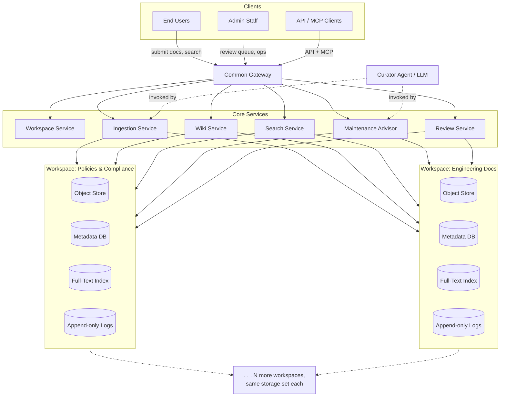

# 00 — Overview

## 1. Purpose

This spec defines an **Enterprise Wiki Platform** ("the Platform") that adapts Andrej Karpathy's
[LLM Wiki pattern](https://gist.github.com/karpathy/442a6bf555914893e9891c11519de94f) — a small,
LLM-maintained knowledge base built from raw sources, a curated wiki, and a schema — into a
multi-workspace, horizontally scalable system suitable for enterprise use.

Karpathy's pattern works well for a single corpus under ~100k tokens maintained by one person and
one LLM session. The Platform keeps the same conceptual core (raw sources → curated wiki → schema,
with ingest / query / lint as the three operations) but adds what's needed to run it as shared
infrastructure: durable multi-tenant-ish storage, async backend processing, a review/approval
loop for human admins, search at scale, and management surfaces (API, MCP, admin UI).

**The Platform is multi-workspace from day one.** It does not host one corpus — it hosts an
extensible set of independent **workspaces**, each a complete instance of Karpathy's
raw/wiki/schema pattern (its own raw sources, curated wiki pages, and `SCHEMA.md`), partitioned by
document type (§2 Principle 4; full model in [01](01-architecture-and-data-model.md) §3). The
Common Gateway and federated search (§2 Principle 8) exist specifically to make "many small wikis"
behave like one platform.

## 2. Design Principles

| # | Principle | Source / Rationale |
|---|---|---|
| 1 | **Raw sources are immutable, the wiki is derived** | Karpathy's core invariant — the wiki can always be regenerated from sources; sources are the single source of truth. |
| 2 | **The wiki is structured, cited, cross-referenced markdown** | Concept/entity/source/comparison pages, `overview.md` hub, `index.md` catalog, append-only `log.md` — same backbone as the reference pattern, per [[wiki-r2]]/[[llmwiki-research]] tool conventions observed in this environment. |
| 3 | **A schema document governs each workspace** | Each workspace carries its own `SCHEMA.md` (taxonomy, conventions, curator behavior, thresholds) — the enterprise equivalent of Karpathy's `CLAUDE.md`. |
| 4 | **Workspaces are partitioned by document type, not org unit** | Per the chosen tenancy model: one organization, multiple wikis, where each wiki ("workspace") corresponds to a category of document (e.g. *Engineering Specs*, *Policies & Compliance*, *Product Docs*, *Meeting Notes*). |
| 5 | **A common gateway fronts all storage, indices, and logs** | Every read/write — from end users, admins, API clients, and MCP clients — goes through one gateway layer, which routes to the correct workspace's object store, metadata DB, full-text index, and log store. This is what makes "multiple storages/indices/logs" tractable and horizontally scalable. |
| 6 | **Ingestion is asynchronous and stateful**, modeled after Context7's observed lifecycle (`initial → processing → finalized → error`), extended with `pending_review` and `superseded` states. Nothing the curator does to the wiki happens synchronously with a user's upload. |
| 7 | **Humans stay in the loop for consequential changes** | New documents, suspected duplicates, and proposed reindex/prune actions all become **review items** for admin staff — the curator agent proposes, it does not unilaterally delete or restructure. |
| 8 | **Retrieval is lexical and catalog-based, federated across workspaces, with no LLM in the path** | Full-text search over curated wiki pages — and each workspace's `index.md` catalog — returns ranked, cited candidates synchronously, with no embedding step and no rerank/synthesis call. There is deliberately **no vector index**: this matches Karpathy's own framing of the wiki pattern as an alternative to vector-DB RAG, where the curated wiki (not re-derived embeddings) is what gets queried. Federation — search runs across every workspace the caller can access (see [04](04-search-and-retrieval.md) §4) — is the routing mechanism, so no separate query-time classifier is needed. The Curator Agent's LLM reasoning stays where Karpathy puts it: ingest, lint, and ingest-time duplicate judgment — never invoked synchronously for a search request. Consuming agents (e.g. an MCP-connected LLM) synthesize answers themselves over returned pages, mirroring how Karpathy's own LLM session reads `index.md` then drills into pages. |
| 9 | **Everything is versioned and reversible** | Every wiki page write creates a new version; rollback creates a new version pointing at old content. Nothing is destructively overwritten. |
| 10 | **Dual interface: API and MCP** | The same gateway capabilities are exposed as a conventional REST/GraphQL API (for apps/services) and as an MCP server (for AI agents/IDEs), following the resolve→retrieve convention seen in Context7's MCP tools. |

## 3. Scope

### In scope
- Logical architecture for ingestion, storage, indexing, search, versioning, and admin operations.
- Workspace model (document-type-based) and the common gateway that fronts all backing stores.
- End-user submission → review → ingest pipeline, including duplicate detection.
- Background maintenance: staleness/reindex detection, pruning detection, lint, both surfaced as admin review items.
- Admin console scope (not pixel-level UI design).
- API and MCP contracts at the resource/operation level.
- Horizontal scaling and deployment topology, described in vendor-neutral terms.
- A roadmap of additional features for completeness.

### Out of scope
- Specific vendor/product selection (storage, search, LLM provider) — components are
  described by role, with example technologies, per the agreed "vendor-neutral, logical
  components" approach.
- Pixel-level UI/UX design, exact API request/response schemas, infra-as-code.
- Numeric capacity planning (QPS, storage volume, SLAs) — the spec defines *how* the system scales;
  the organization fills in concrete targets when sizing an implementation (see
  [06-api-mcp-and-scaling.md](06-api-mcp-and-scaling.md) §6 for the placeholder).

## 4. Document Map

| Doc | Contents |
|---|---|
| [01-architecture-and-data-model.md](01-architecture-and-data-model.md) | System architecture diagram, common gateway, workspace model, page/content types, versioning model |
| [02-storage-and-indexing.md](02-storage-and-indexing.md) | Object store (incl. wiki markdown export), metadata DB, full-text index, log/event store; per-workspace partitioning; indexing lifecycle |
| [03-ingestion-and-review-workflows.md](03-ingestion-and-review-workflows.md) | Submission → classification/routing → dedup → review queue → ingest into wiki pages |
| [04-search-and-retrieval.md](04-search-and-retrieval.md) | Federated lexical/catalog search architecture, cross-workspace search, query contracts |
| [05-admin-backend-and-maintenance.md](05-admin-backend-and-maintenance.md) | Admin console scope, reindex/pruning advisor, repository management, versioning/rollback ops, performance monitoring |
| [06-api-mcp-and-scaling.md](06-api-mcp-and-scaling.md) | Public API + MCP surface, auth/access model, horizontal scaling and deployment topology |
| [07-additional-features-and-roadmap.md](07-additional-features-and-roadmap.md) | Completeness features (RBAC, notifications, analytics, connectors, etc.) and phased roadmap |

## 5. System at a Glance

## 6. Glossary

| Term | Meaning |
|---|---|
| **Platform** | The overall Enterprise Wiki Platform described by this spec. |
| **Workspace** | A self-contained wiki dedicated to one category of document (e.g. "Policies"), with its own schema, taxonomy, and (logically) partitioned storage/indices. The unit of "multiple wikis" in the chosen tenancy model. |
| **Common Gateway** | The single entry point (API + MCP) that authenticates, routes, and fans requests out to the correct workspace's services and stores. |
| **Raw Source** | An immutable original document (uploaded file, crawled page, connector export) stored in the object store. Never edited after ingest; superseded by new versions instead. |
| **Wiki Page** | A curated markdown document with required frontmatter, one of the page types in §2 of [01](01-architecture-and-data-model.md). Maintained by the Curator Agent, versioned on every change. |
| **Schema (`SCHEMA.md`)** | Per-workspace configuration: document-type taxonomy, page conventions, curator behavioral rules, staleness/pruning thresholds, dedup sensitivity. The enterprise analogue of Karpathy's `CLAUDE.md`. |
| **Curator Agent** | The LLM-driven process that reads raw sources and writes/updates wiki pages during ingest, and that performs lint/maintenance analysis. |
| **Maintenance Advisor** | The background service that scans workspaces for staleness, low-traffic/orphaned content, and likely duplicates, and emits **review items** with proposed actions (reindex, prune, merge). |
| **Review Item** | A record in the admin review queue: a new submission, a duplicate-candidate flag, or a maintenance recommendation, each with a proposed action awaiting admin approval/rejection. |
| **Ingestion Pipeline** | The async, stateful process taking a raw source from `submitted` through classification, dedup check, optional review, to `ingested` (wiki updated) or `error`. |
| **Version** | An immutable snapshot of a wiki page's content + metadata at a point in time. Pages have a linear version history; "current" is a pointer, never an overwrite. |
| **Rollback** | Creating a new version whose content equals a prior version's content — non-destructive reversion. |
| **Reindex** | Re-running full-text search-index updates for a page or workspace, typically because the underlying source or page content changed materially. |
| **Prune** | Archiving or removing a wiki page (and/or its source) because it's stale, superseded, or low-value — always admin-approved via a review item. |
| **Lint** | The periodic health check (per Karpathy) — contradictions, orphans, missing cross-refs, stale claims — extended here to also seed Maintenance Advisor recommendations. |

## 7. Requirements Traceability

Maps each requirement from the project brief to the document(s) that address it.

| Requirement | Addressed in |
|---|---|
| Karpathy's general pattern (raw / wiki / schema; ingest / query / lint) | §2 above; [01](01-architecture-and-data-model.md), [03](03-ingestion-and-review-workflows.md) |
| Enterprise-scale schema changes | [01](01-architecture-and-data-model.md), [02](02-storage-and-indexing.md) |
| Robust storage mechanism | [02](02-storage-and-indexing.md) |
| Horizontal scaling | [06](06-api-mcp-and-scaling.md) |
| Multiple storages/indices/logs behind a common gateway | [01](01-architecture-and-data-model.md) §3, [02](02-storage-and-indexing.md) |
| Backend management: ingestion, pruning, versioning, repo management | [03](03-ingestion-and-review-workflows.md), [05](05-admin-backend-and-maintenance.md) |
| Admin-only backend UI, performance-focused | [05](05-admin-backend-and-maintenance.md) |
| Exposure via API and MCP | [06](06-api-mcp-and-scaling.md) |
| Robust search mechanism | [04](04-search-and-retrieval.md) |
| End-user document submission → review item for admin | [03](03-ingestion-and-review-workflows.md) |
| Identify indexing/reindexing needs, propose actions | [05](05-admin-backend-and-maintenance.md) §3 |
| Identify pruning needs, propose actions | [05](05-admin-backend-and-maintenance.md) §4 |
| Identify potential duplicates, raise review item | [03](03-ingestion-and-review-workflows.md) §4, [05](05-admin-backend-and-maintenance.md) §5 |
| Versioning with rollback | [01](01-architecture-and-data-model.md) §5, [05](05-admin-backend-and-maintenance.md) §6 |
| Propose additional completeness features | [07](07-additional-features-and-roadmap.md) |

---
Next: [01-architecture-and-data-model.md](01-architecture-and-data-model.md)
