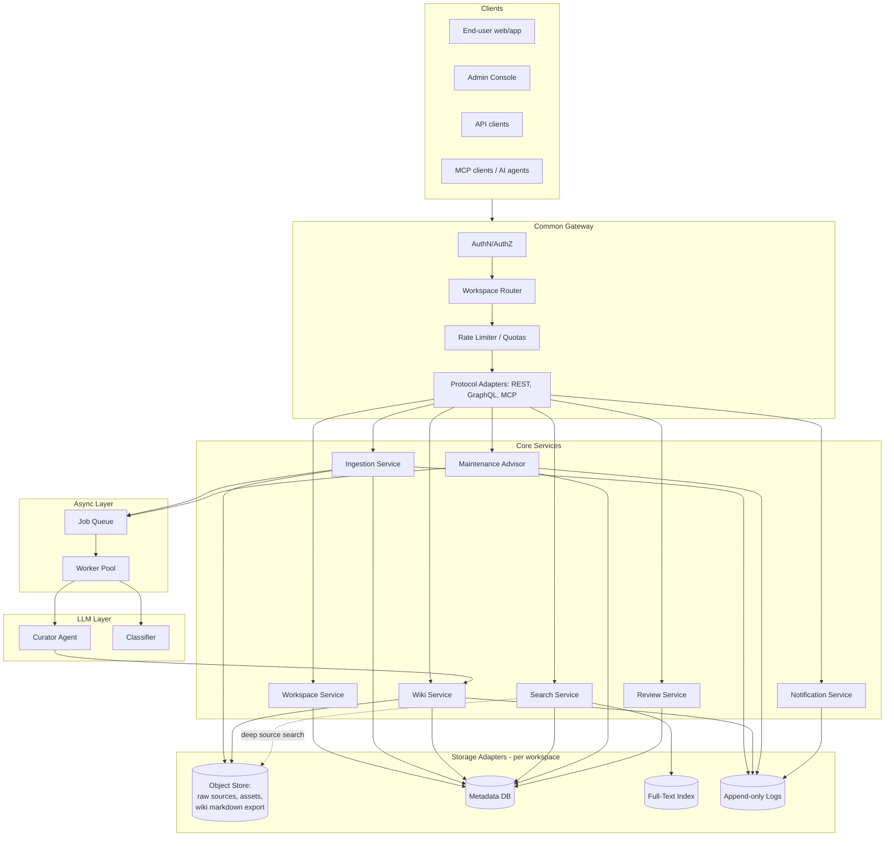
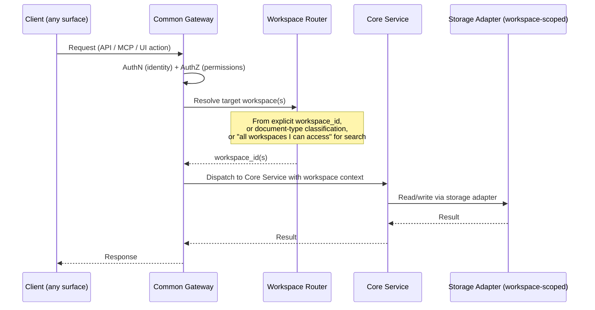
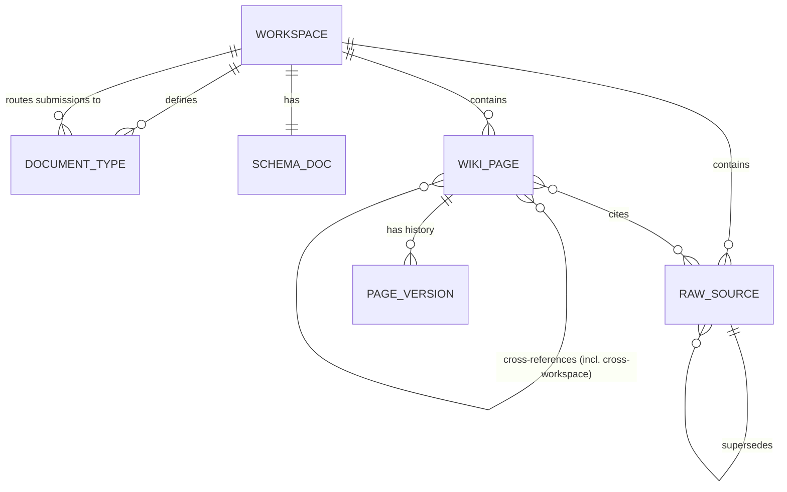
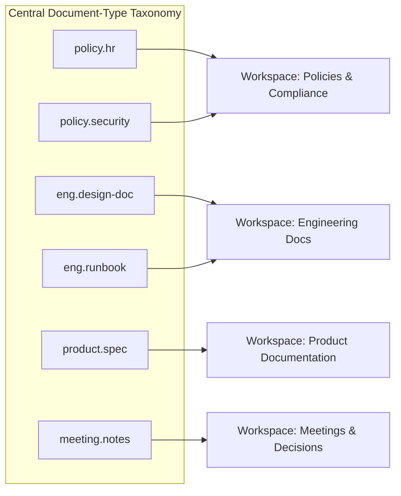
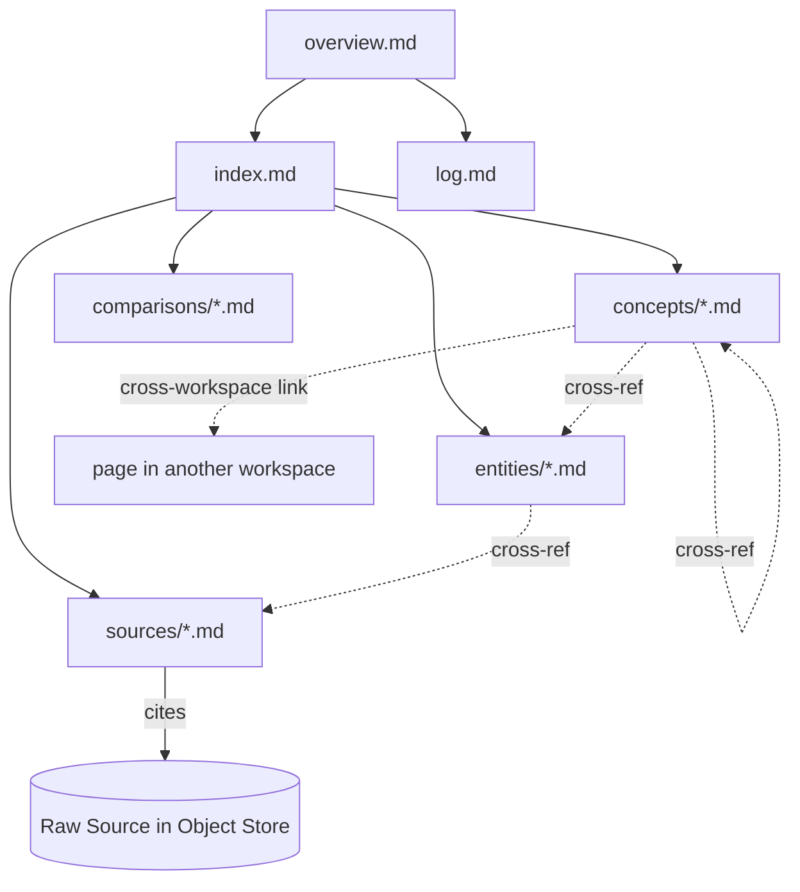
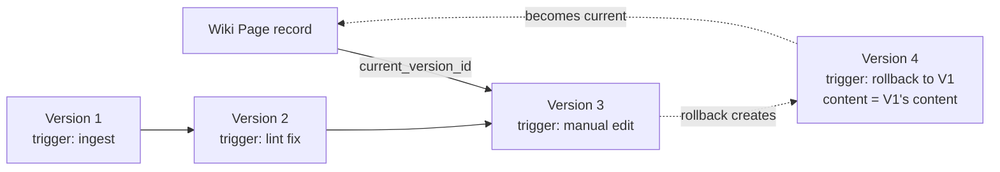

# 01 — Architecture and Data Model

## 1. Layered Architecture



**Layer responsibilities**

| Layer | Responsibility |
|---|---|
| Clients | End-user UI, admin console, third-party API integrations, MCP-capable AI agents/IDEs. |
| Common Gateway | Single entry point. AuthN/AuthZ, workspace resolution/routing, rate limiting, protocol adaptation (REST/GraphQL/MCP → internal calls). Stateless, horizontally scalable (see [06](06-api-mcp-and-scaling.md)). |
| Core Services | Business logic: workspace config, ingestion orchestration, wiki page CRUD/versioning, search orchestration, maintenance analysis, review queue, notifications. |
| Async Layer | Queue + workers for anything that calls an LLM or touches an index — ingestion/curation, classification, full-text indexing, lint/advisor scans. Keeps the gateway/API path fast and decoupled. |
| Storage Adapters | Per-workspace bindings to the physical stores described in [02](02-storage-and-indexing.md). Core services never hardcode storage technology — they call adapters. |
| LLM Layer | Curator Agent (authors/updates wiki pages, runs lint, makes ingest-time duplicate/merge judgments), Classifier (routes submissions to a workspace/document type and tags `content_shape` — see [07](07-additional-features-and-roadmap.md) §1). Neither is invoked on the search/retrieval path (see [04](04-search-and-retrieval.md) §1). |

## 2. The Common Gateway

The gateway is the **only** path into the Platform for every actor (end users, admins, API
clients, MCP clients). Its job is routing and cross-cutting concerns — it holds no business logic
and no direct storage connections.



**Why a single gateway, given multiple storages/indices/logs per workspace:** every workspace has
its own object store namespace, metadata DB schema/partition, full-text index, and
log stream (see [02](02-storage-and-indexing.md)). Without a common gateway, every client would
need to know workspace topology and storage technology. The gateway collapses this to: *"send me a
request; I know which workspace(s) and which stores to touch."*

**Workspace resolution strategies**

| Request type | Resolution |
|---|---|
| Direct page/workspace operation | `workspace_id` is explicit in the request (path/param). |
| New document submission | No workspace specified — the **Classifier** (§3 of [03](03-ingestion-and-review-workflows.md)) determines document type → workspace during ingestion. |
| Search query | Defaults to "all workspaces the caller can access"; caller may scope to specific workspace(s). Results are merged across workspaces (see [04](04-search-and-retrieval.md) §4). |
| Cross-workspace link resolution | Gateway re-checks the caller's AuthZ against the *target* workspace before resolving a link from one workspace's page into another. |

**Note on query-time routing — no query classifier.** Document *submissions* are routed to a
single workspace by the ingest-time Classifier (above). Search *queries* are not routed by a
classifier at all: by default a query fans out to every workspace the caller can access (federated
search, [04](04-search-and-retrieval.md) §4), with an optional lexical pre-filter against the
central document-type taxonomy ([04](04-search-and-retrieval.md) §4) narrowing the fan-out set when
the query text matches taxonomy keywords. This avoids needing an LLM (or any) classifier in the
query path, consistent with Principle 8 ([00](00-overview.md) §2).

## 3. Workspace Model

A **workspace** is the unit of partitioning. Per the agreed tenancy model (single organization,
multiple wikis, split by **document type** rather than org unit), each workspace corresponds to a
category of content — e.g. *Engineering Specs*, *Policies & Compliance*, *Product Documentation*,
*Meeting Notes & Decisions*, *Customer Contracts*.



**Workspace record** (conceptual fields):

| Field | Description |
|---|---|
| `workspace_id` | Stable identifier, used by the gateway router and storage adapters as the partition key. |
| `name`, `description` | Human-readable. |
| `document_types[]` | The taxonomy of document types this workspace accepts (drives ingestion routing — see [03](03-ingestion-and-review-workflows.md) §3). |
| `schema_ref` | Pointer to this workspace's `SCHEMA.md` (conventions, curator rules, thresholds — see §6). |
| `status` | `active` \| `archived` \| `read_only`. |
| `storage_bindings` | Adapter config for this workspace's object store namespace, metadata partition, FTS index, log stream (§1 of [02](02-storage-and-indexing.md)). |
| `access_policy_ref` | Who can read/write/submit/admin this workspace (see [06](06-api-mcp-and-scaling.md) §4). |

**Document-type taxonomy and routing.** The taxonomy is a flat or shallow-hierarchical list of
document-type labels (e.g. `policy.hr`, `policy.security`, `eng.design-doc`, `eng.runbook`,
`product.spec`, `meeting.notes`). Each label maps to exactly one workspace. The taxonomy is
maintained centrally by admins (it's effectively the gateway's routing table) but each workspace
only *declares* the subset of labels it owns.



**Workspace lifecycle.** Created by admins (name, taxonomy slice, initial schema). May be
`archived` (read-only, excluded from default search/ingestion routing but still queryable) or, in
rare cases, deleted (requires explicit admin action + export, see [05](05-admin-backend-and-maintenance.md) §7).

## 4. Page and Content Types

Within a workspace, the wiki is a set of markdown pages, all sharing required frontmatter
(§6). Page **types**:

| Type | Cardinality | Purpose |
|---|---|---|
| `overview` | 1 per workspace | Hub page: scope, source/page counts, key findings, recent updates. Updated after every ingest (per Karpathy's pattern). |
| `index` | 1 per workspace | Catalog of all pages with one-line summaries, organized by category — primary navigation aid. |
| `log` | 1 per workspace | Append-only chronological record of ingests, queries, lint passes, and admin actions. Never edited, only appended. |
| `concept` | many | Abstract ideas — frameworks, policies-as-concepts, methodologies. |
| `entity` | many | Concrete things — people, systems, products, vendors, datasets, named documents. |
| `source` | one per ingested raw source | Summary/metadata page for a raw source: what it is, key extracted points, links to the source in object storage. |
| `comparison` | many, optional | Deep comparisons between two or more concepts/entities. |

`review-item` is **not** a wiki page type — review items live in the metadata DB as structured
records (§3 of [03](03-ingestion-and-review-workflows.md)), though a resolved review item may
*result in* wiki pages being created/updated.

**`source` pages have two shapes.** What a `source` page contains depends on the raw source's
`content_shape` (assigned by the Classifier alongside `document_type`, [03](03-ingestion-and-review-workflows.md)
§3): a `narrative` source (prose documents) gets the summary/citations page described above; a
`structured_data` source (datasets, schemas, configs, API specs) gets a metadata/intent page
instead — schema, fields, purpose, not a prose summary. Both remain `page_type: source`; the
distinction is in content, not a new page type. See [07](07-additional-features-and-roadmap.md) §1
for the full treatment.



## 5. Versioning Model

**Principle:** wiki pages are append-only at the version level. Editing a page never overwrites
history — it creates a new version and moves the "current" pointer.



**Version record** (conceptual fields): `version_id`, `page_id`, `content` (markdown +
frontmatter), `author` (`user:<id>` or `system:curator` or `system:advisor`), `created_at`,
`change_summary`, `diff_ref` (diff vs. previous version), `trigger`
(`ingest|manual_edit|rollback|lint_fix|prune`), and for rollbacks, `restored_from_version_id`.

**Rollback** = admin selects a prior version → system creates a new version with that version's
content, `trigger=rollback`, `restored_from_version_id` set. The page's `current_version_id` now
points at this new version. History remains intact and shows the rollback event explicitly (this
is also logged to `log.md` and the audit log per [02](02-storage-and-indexing.md) §5).

**Raw sources are immutable, not versioned in place.** A "new version" of a source document is a
new `RAW_SOURCE` record with `supersedes = <old_source_id>`. The old source remains in object
storage (subject to retention policy). Re-ingesting against the new source produces new wiki page
versions whose `diff_ref` and `change_summary` reference the source change.

**Retention.** How many versions/superseded sources are kept is configurable per workspace via
`SCHEMA.md` and enforced by pruning (see [05](05-admin-backend-and-maintenance.md) §4) — never
silently by the storage layer.

## 6. Required Frontmatter (all wiki page types)

```yaml
---
title: <human-readable title>
description: <one-sentence summary>
date: <YYYY-MM-DD, last substantial revision>
tags: [<topic tags, >= 2>]
page_type: overview | index | log | concept | entity | source | comparison
workspace_id: <owning workspace>
status: draft | published | archived
current_version: <version_id>
---
```

Citations use markdown footnotes referencing raw sources by full filename (and page number for
PDFs), consistent with the conventions already used by the `llmwiki-research`/`wiki-r2` tooling
observed in this environment. Cross-references use standard markdown links; links that target
another workspace are written as fully-qualified workspace-relative paths so the gateway can
resolve and AuthZ-check them.

## 7. Per-Workspace Schema (`SCHEMA.md`)

Each workspace owns a `SCHEMA.md` — the enterprise analogue of Karpathy's `CLAUDE.md` — defining:

- The slice of the document-type taxonomy this workspace owns (drives routing, §3).
- Page conventions beyond the global defaults in §6 (e.g. extra required tags).
- Curator Agent behavioral rules for this workspace (tone, depth, what counts as a "concept" vs
  "entity" for this content category).
- Staleness and pruning thresholds (consumed by the Maintenance Advisor, [05](05-admin-backend-and-maintenance.md) §3–4).
- Duplicate-detection sensitivity (consumed during ingestion, [03](03-ingestion-and-review-workflows.md) §4).

`SCHEMA.md` is itself a versioned artifact (stored like a wiki page, `page_type` not applicable —
treated as workspace configuration) so changes to workspace policy are auditable and reversible.

---
Previous: [00-overview.md](00-overview.md) · Next: [02-storage-and-indexing.md](02-storage-and-indexing.md)
