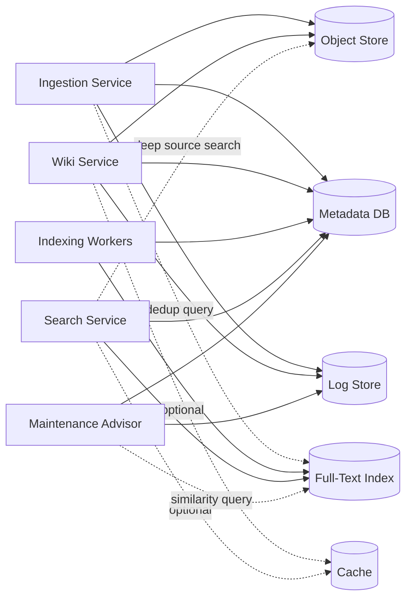
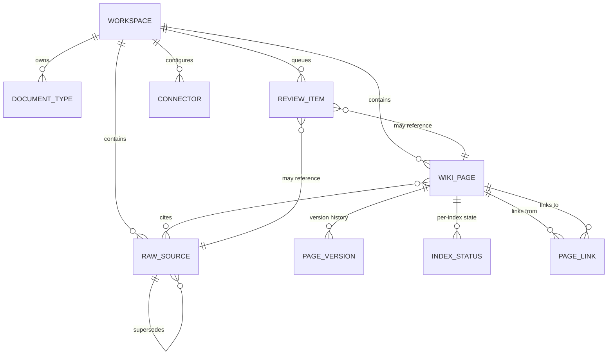
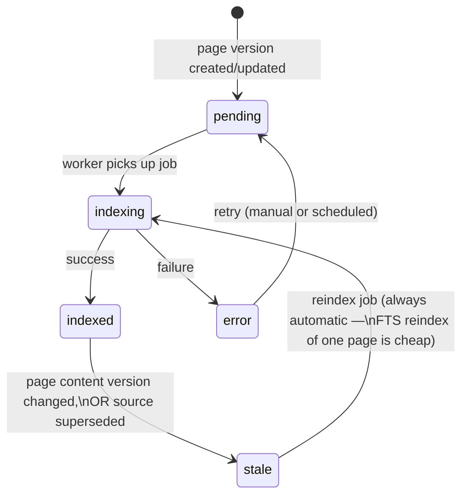

# 02 — Storage and Indexing

All storage is described by **role**, not product. Each role is a separate physical store,
partitioned per workspace, and reachable only through storage adapters behind the Common Gateway
(§2 of [01](01-architecture-and-data-model.md)).

There is deliberately **no vector index** in this design — see [00](00-overview.md) §2 Principle
8. The Full-Text Index (§4) is the Platform's only retrieval index, and also backs near-duplicate
detection (§4, [03](03-ingestion-and-review-workflows.md) §4, [05](05-admin-backend-and-maintenance.md) §2).

## 1. Storage Components Overview

| Component | Stores | Written by | Read by | Example technologies |
|---|---|---|---|---|
| **Object Store** | Raw sources, large binary assets, generated diagrams (SVG), page-version diffs, and a materialized markdown export of each workspace's wiki | Ingestion Service (sources/assets), Wiki Service (wiki export, page-version diffs) | Wiki Service (citations), Search Service (deep-source-search text extraction), Admin Console (export/backup, version diffs), file-based agent access | S3-compatible object storage (AWS S3, GCS, Azure Blob, MinIO, Cloudflare R2) |
| **Metadata DB** | Workspaces, taxonomy, wiki pages + versions, page links, raw source records, review items, index-status table, access policies | Workspace/Wiki/Ingestion/Review Services | All core services | Relational DB (PostgreSQL, MySQL); horizontally-scaled variants (CockroachDB, Aurora) for very large deployments |
| **Full-Text Index** | Lexical index of wiki page content (+ optionally source text) | Indexing workers (async) | Search Service, Ingestion Service (dedup queries), Maintenance Advisor (similarity scans) | PostgreSQL full-text search, OpenSearch/Elasticsearch, Typesense, Meilisearch |
| **Append-Only Log / Event Store** | Ingestion events, query events, admin actions, lint/advisor runs | All core services (write-only, append) | Maintenance Advisor, Admin Console, audit/export | Time-partitioned table in the metadata DB, or a dedicated log/stream store (Kafka, cloud log service) |
| **Cache (optional)** | Hot wiki pages, hot search results, resolved cross-references | Wiki/Search Services | Wiki/Search Services | Redis-compatible in-memory store |

## 2. Object Store — Raw Sources, Assets & Wiki Export

- **Path scheme**: `/{workspace_id}/sources/{source_id}/{original_filename}` — workspace prefix
  enables per-workspace lifecycle rules, access policies, and (if needed) physical bucket
  separation without changing the logical model.
- **Immutability**: objects are write-once. A "new version" of a source is a new `source_id` with
  `supersedes` set in the Metadata DB (§3) — the object itself is never modified.
- **Lifecycle tags**: `active`, `superseded`, `archived` — set by the Metadata DB record, enforced
  by object-store lifecycle rules (e.g. move `archived` objects to colder storage tiers after a
  retention window defined in `SCHEMA.md`).
- **Generated assets** (SVG diagrams embedded in wiki pages) are also stored here under
  `/{workspace_id}/assets/`, referenced by wiki pages like any other citable asset.
- **Page-version diffs** are stored under `/{workspace_id}/diffs/{version_id}.diff` — a unified
  diff against the previous version, computed once and written by the Wiki Service alongside the
  `page_version` row (§3) it belongs to; referenced by that row's `diff_ref` field.

**Wiki markdown export** (`/{workspace_id}/wiki/...`): a read-only, regenerated mirror of the
workspace's current wiki — `overview.md`, `index.md`, `log.md`, `concepts/*.md`, `entities/*.md`,
`sources/*.md`, `comparisons/*.md`, and `SCHEMA.md` — written by the Wiki Service whenever
`wiki_page.current_version_id` changes (write-through or short-delay async; not required to be
transactional with the Metadata DB write, which remains the system of record per §3). This gives
the workspace the same `raw/`, `wiki/`, `schema` directory shape Karpathy's original pattern uses,
and serves two purposes the Metadata DB alone doesn't:

1. **Backup/migration/export** — a point-in-time directory snapshot of a workspace's wiki, usable
   independent of the Platform's database.
2. **File-based agent access** — an agent with filesystem/grep access to this prefix can consume
   the wiki exactly as Karpathy's original pattern describes (read `index.md`, drill into pages),
   without going through the API/MCP gateway. This is an *additional* consumption path, not a
   replacement for the gateway-mediated one ([06](06-api-mcp-and-scaling.md)). Access is
   **read-only and opt-in per workspace** via `access_policy` (§3) — a workspace admin grants it
   explicitly, it is not automatic for every `reader`/`contributor`.

## 3. Metadata DB — System of Record

The Metadata DB is the **only** source of truth for what currently exists and what is current. The
Full-Text Index is *derived* and may be rebuilt from it at any time; the wiki markdown export (§2)
is likewise a regenerated projection.

| Table (conceptual) | Key fields |
|---|---|
| `workspace` | `workspace_id`, `name`, `document_types[]`, `schema_ref`, `status`, `storage_bindings` |
| `document_type` | `type_code`, `workspace_id`, `description` |
| `raw_source` | `source_id`, `workspace_id`, `object_key`, `filename`, `content_hash`, `content_shape` (`narrative\|structured_data`), `submitted_by` (`user:<id>\|connector:<connector_id>`), `artifact_identity`, `source_version`, `source_modified_at` (`structured_data` only — [03](03-ingestion-and-review-workflows.md) §3–4), `supersedes`, `status` (`active\|superseded\|archived\|rejected`), `pipeline_state` (`submitted\|classifying\|classified\|duplicate_check\|pending_review\|ingesting\|ingested\|error\|rejected` — [03](03-ingestion-and-review-workflows.md) §1; denormalized current-state pointer, `ingestion_log` in §5 holds full history), `ingested_at` |
| `wiki_page` | `page_id`, `workspace_id`, `path`, `page_type`, `current_version_id`, `status` (`draft\|published\|archived`) |
| `page_version` | `version_id`, `page_id`, `content`, `frontmatter`, `author`, `created_at`, `change_summary`, `diff_ref` (object-store path, §2), `trigger`, `restored_from_version_id` |
| `page_link` | `from_page_id`, `to_page_id`, `link_type` (`cross_reference\|cross_workspace`), `updated_at` |
| `index_status` | `page_id`, `index_type` (`fts`), `state`, `last_indexed_at`, `last_content_version` |
| `review_item` | `review_id`, `workspace_id` (nullable — a `submission`/`classification` item can exist before one is resolved, [09](09-implementation-notes.md) §19), `kind` (`submission\|classification\|duplicate\|reindex\|prune`), `severity`, `subject_ref`, `proposed_action`, `status` (`open\|resolved`), `resolved_action`, `created_at`, `resolved_by`, `resolved_at` |
| `connector` | `connector_id`, `workspace_id`, `type`, `config`, `credential_ref` (pointer into the external secrets manager — the secret itself is never stored here, [09](09-implementation-notes.md) §13), `schedule`, `ingestion_policy`, `state` (`enabled\|disabled\|disabled_auth`), `last_sync_cursor` ([09](09-implementation-notes.md) §4), `last_run_at` |
| `access_policy` | `workspace_id`, `principal` (a user, group, API/MCP client, or `connector:<connector_id>` — see [06](06-api-mcp-and-scaling.md) §3), `role` |

`page_link` rows are (re)written by the Wiki Service whenever a page's cross-references are parsed
during a write — `link_type=cross_reference` for same-workspace links, `cross_workspace` for links
into another workspace. This is what the Orphan/Low-Traffic Detector
([05](05-admin-backend-and-maintenance.md) §2) uses for inbound-reference counts, and what feeds
the cross-workspace knowledge graph view ([07](07-additional-features-and-roadmap.md) §4).

**Partitioning**: large, append-heavy tables (`page_version`, `raw_source`, `page_link`, log
tables in §5) are partitioned by `workspace_id` (and secondarily by time for versions/logs). This
is the primary horizontal-scaling lever for the Metadata DB — see [06](06-api-mcp-and-scaling.md) §4.

## 4. Full-Text / Lexical Index

The Full-Text Index is the **only** index the Platform queries at request time — there is no
vector index ([00](00-overview.md) §2 Principle 8). It serves two distinct workloads:

- **Search & retrieval** ([04](04-search-and-retrieval.md) §3): exact-match, keyword, phrase, and
  filtered (tags, page_type, date range) queries over curated wiki page content. Indexes curated
  wiki pages by default; optionally raw source text per workspace policy ("deep source search",
  [04](04-search-and-retrieval.md) §2).
- **Near-duplicate / similarity detection**: at ingest time ([03](03-ingestion-and-review-workflows.md)
  §4) and by the periodic Existing-Content Duplicate Detector ([05](05-admin-backend-and-maintenance.md)
  §2), the new or existing text is run as a "more like this" / similarity query against the
  workspace's own indexed pages. High-scoring matches above the workspace's configured threshold
  (`SCHEMA.md`) are candidates; the Curator Agent makes the final near-duplicate judgment during
  ingest or lint — LLM use stays confined to ingest/lint, never the query path.

**Partitioning**: logically partitioned by `workspace_id` (every query is workspace-scoped or
multi-workspace-scoped, never global-unscoped). The default implementation is a single index/
cluster with `workspace_id` as a mandatory filter field — this lets a federated query touch one
index with a `workspace_id IN (...)` filter rather than fanning out to per-workspace shards and
merging incomparable scores (see [04](04-search-and-retrieval.md) §4). Workspaces with very large
corpora or stricter isolation requirements may get a dedicated index instance without changing the
gateway contract.

Each indexed entry is tagged with `workspace_id`, `page_id`, and `version_id`, mirroring
`index_status` (§3).

## 5. Append-Only Log / Event Store

Four logical streams, all append-only and partitioned by `workspace_id` + time:

| Stream | Records | Consumed by |
|---|---|---|
| `ingestion_log` | Every state transition of every raw source through the ingestion pipeline ([03](03-ingestion-and-review-workflows.md) §1) | Admin Console, Maintenance Advisor |
| `query_log` | Search requests (full detail, retained per policy below), latency, which pages were returned | Maintenance Advisor (orphan/low-traffic detection), analytics ([07](07-additional-features-and-roadmap.md)) |
| `admin_action_log` | Review item resolutions, rollbacks, manual edits, workspace/schema changes | Audit/compliance export |
| `lint_log` | Curator Agent lint passes: contradictions found, cross-refs fixed, staleness flags raised | Maintenance Advisor, Admin Console |

`log.md` (per Karpathy's pattern, §4 of [01](01-architecture-and-data-model.md)) is a **human-
readable materialized view** generated from `ingestion_log` + `lint_log` + `admin_action_log` for
a given workspace — the structured streams are the system of record; `log.md` is rendered from
them for the wiki's own navigation (and is part of the wiki markdown export, §2).

**`query_log` retention policy**: entries (query text, principal, resolved workspaces, returned
page IDs/scores) are retained in full detail for 90 days, then purged — the retention window is
itself the privacy boundary, with no separate anonymization step. The Orphan/Low-Traffic
Detector's lookback window ([05](05-admin-backend-and-maintenance.md) §2, default 90 days per
`SCHEMA.md`) fits within this retention period.

## 6. Optional Cache Layer

A read-through cache for (a) frequently-read published wiki pages and (b) recent search result
sets. Cache entries are keyed by `(workspace_id, page_id, version_id)` or `(workspace_id,
query_hash)` so a new page version or re-index naturally invalidates stale entries without
explicit cache-busting logic. Not required for correctness — purely a latency optimization, called
out again in [06](06-api-mcp-and-scaling.md) §4.

## 7. Indexing Lifecycle

Every wiki page has one `index_status` row for the Full-Text Index. This is the mechanism the
Search Service uses to know what's queryable, and the mechanism the Maintenance Advisor uses to
find reindex candidates.

**Triggers into `stale`**:
1. A new `page_version` is created for a page that's currently `indexed` (any trigger — ingest,
   manual edit, rollback, lint fix).
2. A cited `raw_source` is superseded (the page may need re-summarization — flagged for the
   Curator Agent, not auto-reindexed).

**Reindexing is cheap and always automatic.** Without embeddings, reindexing a single page is a
lexical-index update with no LLM call — there's no "costly bulk reindex" class of work analogous
to an embedding-model upgrade. The Maintenance Advisor's `reindex` review item
([05](05-admin-backend-and-maintenance.md) §3) is therefore reserved for cases where the *Curator
Agent re-summarization* work is the costly part: a `SCHEMA.md`/taxonomy change that implies many
pages should be restructured, or a batch of superseded `raw_source`s whose dependent pages need
re-summarization. The index update itself is never the bottleneck.

## 8. Consistency Model

- The **Metadata DB write is the commit point**. A page write is "done" once `page_version` and
  `wiki_page.current_version_id` are updated — this is what `overview.md`/`index.md`/`log.md`
  reflect immediately (in the Metadata DB; the wiki markdown export, §2, follows shortly after).
- Full-Text Index updates are **asynchronous** (queued). A write immediately marks the page's
  `index_status` `stale` (existing page) or `pending` (new page, §7); until the reindex job
  completes, search continues to serve the *previous* version's lexical entries for `stale` pages
  — never invisible.
- This eventual-consistency window is bounded and observable via `index_status`. The Admin Console
  surfaces pages stuck in `pending`/`error` beyond a threshold (operational health,
  [05](05-admin-backend-and-maintenance.md) §8).

---
Previous: [01-architecture-and-data-model.md](01-architecture-and-data-model.md) · Next: [03-ingestion-and-review-workflows.md](03-ingestion-and-review-workflows.md)
