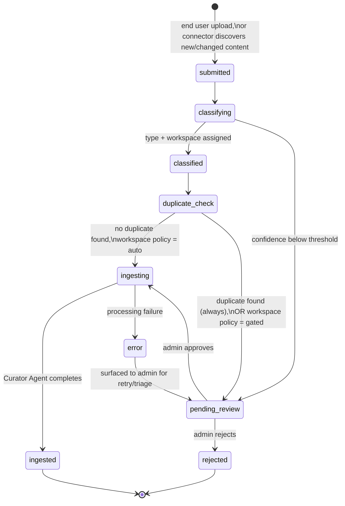
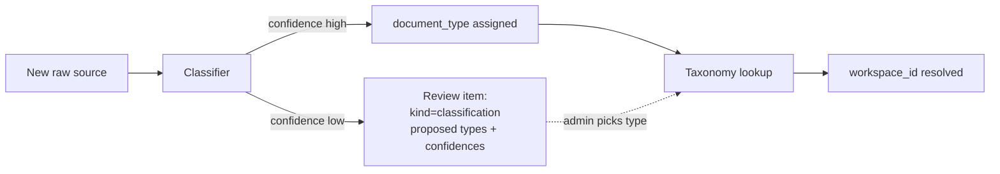
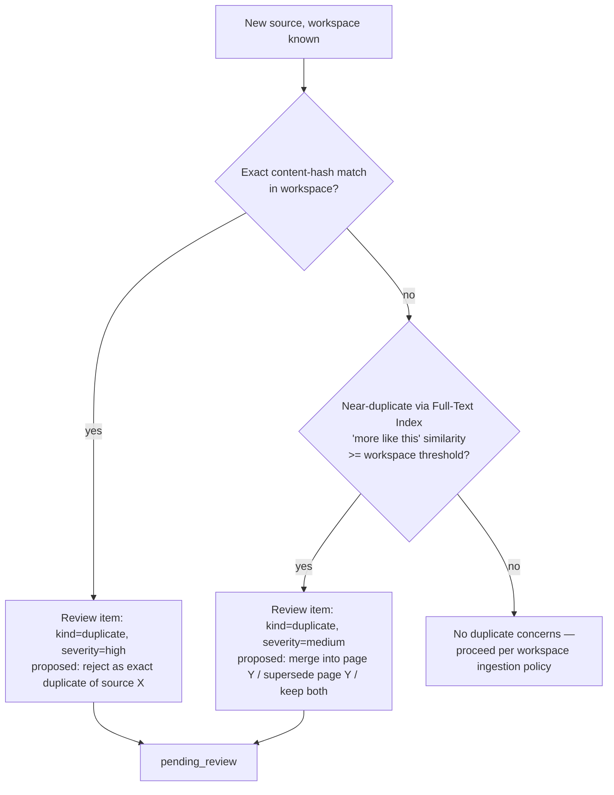
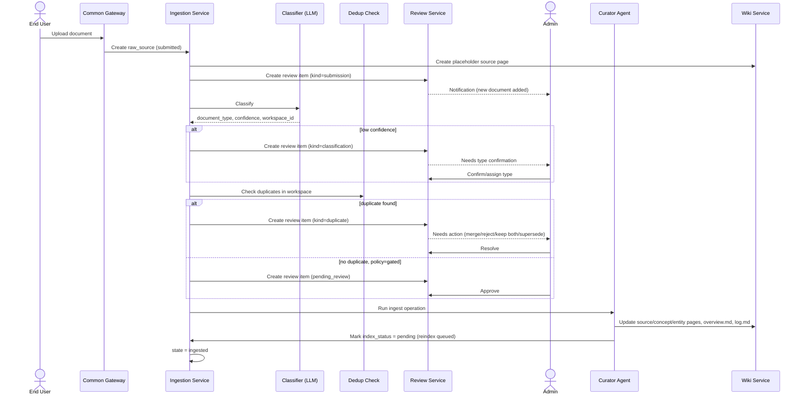

# 03 — Ingestion and Review Workflows

This document covers the path from "someone has a document" to "the wiki reflects it", including
where admin review fits — both the **always-on submission notice** and the **actionable**
review items (duplicates, low-confidence classification).

## 1. Pipeline States

| State | Meaning | Raw source status | Wiki visibility |
|---|---|---|---|
| `submitted` | Source stored in object store, `raw_source` record created | `active` | A placeholder `source` page is created immediately (status `processing`) — the document is "in the wiki" from this point, per the requirement that submissions are added right away. |
| `classifying` | Classifier assigns `document_type` (+ confidence) and resolves `workspace_id` | `active` | placeholder `source` page |
| `classified` | Type + workspace confirmed (confidence ≥ threshold) | `active` | placeholder `source` page |
| `duplicate_check` | Compare against existing content in target workspace | `active` | placeholder `source` page |
| `pending_review` | A review item blocks further automatic processing | `active` | placeholder `source` page, marked "awaiting review" |
| `ingesting` | Curator Agent runs the **ingest** operation (§6) | `active` | placeholder `source` page being updated |
| `ingested` | Curator finished; wiki pages updated, indices marked `pending` | `active` | `source` page + touched concept/entity pages, `overview.md`, `log.md` |
| `rejected` | Admin declined ingestion | `rejected` (retained, excluded from search/ingestion) | placeholder `source` page marked "rejected" with reason |
| `error` | A step failed | `active` | placeholder `source` page marked "error", surfaced to admin |

## 2. Submission

Two entry points feed the same pipeline:

- **End users**: upload a file, paste text, or submit a URL through the Platform UI or API. This
  is the primary path for the requirement *"end user should be able to add documents to the
  wiki."*
- **Connectors** (managed by admins, [05](05-admin-backend-and-maintenance.md) §7): scheduled
  crawlers/integrations (Git repos, Confluence, Notion, websites, OpenAPI specs, `llms.txt` — the
  source types Context7 supports are a useful reference list) that discover new or changed
  content and submit it the same way, with `submitted_by = connector:<connector_id>`.

Either way, a `raw_source` record is created in the **target-undetermined** state — the gateway
accepts the upload without requiring the caller to know which workspace it belongs to; that's the
Classifier's job (§3).

## 3. Classification & Routing

The Classifier (LLM-based, async worker) reads the new source and:

1. Produces a short summary.
2. Assigns a `document_type` label from the **central taxonomy** ([01](01-architecture-and-data-model.md) §3) with a confidence score.
3. Tags `content_shape` (`narrative` | `structured_data`) — independent of `document_type`/workspace
   routing. This determines how the Curator Agent ingests the source (§6 below; full treatment in
   [07](07-additional-features-and-roadmap.md) §1).
4. Resolves `document_type → workspace_id` via the taxonomy's routing table.
5. If confidence ≥ the workspace's configured threshold (`SCHEMA.md`), proceeds to `classified`.
   Otherwise, creates a `kind=classification` review item with the top candidate type(s) and
   moves to `pending_review`.

**Admin actions on a `classification` review item**: confirm the top suggestion, pick a different
type from the taxonomy, or — if nothing fits — create a new document type (which itself is a
repository-management action, [05](05-admin-backend-and-maintenance.md) §7) and assign it.

## 4. Duplicate Detection

Runs once `workspace_id` is known, against that workspace's existing content only.

- **Exact match**: `content_hash` of the new source equals an existing `raw_source.content_hash`
  in the same workspace. Always blocks (`pending_review`), regardless of workspace policy.
- **Near match**: run the new source's summary as a similarity ("more like this") query against
  the workspace's Full-Text Index ([02](02-storage-and-indexing.md) §4), comparing against existing
  wiki page content — no embeddings involved. Threshold is set per workspace in `SCHEMA.md` (dedup
  sensitivity). Scores above threshold always block (`pending_review`) — this is the requirement
  *"identify potential duplicates and mark review item for the admin user."* Lexical similarity
  surfaces *candidates*; the Curator Agent makes the final near-duplicate judgment when the review
  item is resolved (merge/supersede/keep both, below) by reading both documents — LLM use stays
  confined to ingest, never the search/retrieval path.
- **No duplicate**: continues to ingestion per the workspace's ingestion policy (§7).

**Admin actions on a `duplicate` review item**: `reject` (new source marked `rejected`), `merge`
(Curator folds the new source's content into the existing page(s) as an update — produces a new
`page_version` with `trigger=ingest` and a change summary noting the merge), `supersede` (existing
source/page marked superseded, new one becomes canonical), or `keep both` (proceeds to normal
ingestion as a distinct source — use when the similarity is coincidental).

## 5. Submission Review Item (always created)

Independent of the duplicate/classification checks, **every** new submission creates a
`kind=submission` review item the moment the `raw_source` record exists (state `submitted`).
This satisfies *"a review item should be added for the admin staff so that they know [about the]
addition of new document"* — it is informational by default (`status=open`, default disposition
`acknowledge`), but admins can open it to see the placeholder `source` page, reassign workspace,
or halt processing if something looks wrong before `ingesting` completes.

| Review item kind | Created when | Blocks pipeline? | Default disposition |
|---|---|---|---|
| `submission` | Every new `raw_source` | No | Acknowledge (informational) |
| `classification` | Classifier confidence below threshold | Yes (`pending_review`) | None — admin must choose a type |
| `duplicate` | Exact or near-duplicate found | Yes (`pending_review`) | None — admin must choose an action |

## 6. Ingestion ("Ingest" Operation)

Once a source reaches `ingesting` (auto or admin-approved), the Curator Agent performs the
ingest operation from Karpathy's pattern, scoped to the target workspace:

1. Read the raw source (full text/structured content from the object store).
2. Finalize the `source` page (placeholder created in §1), shaped by `content_shape` (§3): a
   `narrative` source gets a full summary, key extracted points, and citations back to the raw
   source; a `structured_data` source gets a metadata/intent page — schema, fields, purpose — per
   [07](07-additional-features-and-roadmap.md) §1.
3. Create or update **concept** and **entity** pages as warranted — typically 5–15 pages touched
   per source, consistent with Karpathy's observation.
4. Update `overview.md`: source count, page count, key findings, recent updates.
5. Append an entry to the `ingestion_log` (materialized into `log.md`).
6. Mark every touched page's `index_status` row `pending` for the Full-Text Index
   ([02](02-storage-and-indexing.md) §7) — this enqueues a reindex job.
7. Set `raw_source.status` and pipeline state to `ingested`.

On failure at any step, state moves to `error` and a review item is raised with the failure
context (state `pending_review`) for admin triage/retry.

## 7. Workspace Ingestion Policy

Set per workspace in `SCHEMA.md`:

| Policy | Behavior after `duplicate_check` finds nothing |
|---|---|
| `auto` (default) | Proceeds directly to `ingesting`. Lower-friction; suited to high-volume, lower-risk document types (e.g. meeting notes, engineering docs from a trusted connector). |
| `gated` | Always moves to `pending_review`, requiring explicit admin approval before `ingesting`. Suited to higher-stakes document types (e.g. policies, legal/compliance content). |

Duplicate and low-confidence-classification review items are **always** raised regardless of this
policy — only the "no concerns found" path is affected.

## 8. End-to-End Sequence

---
Previous: [02-storage-and-indexing.md](02-storage-and-indexing.md) · Next: [04-search-and-retrieval.md](04-search-and-retrieval.md)
