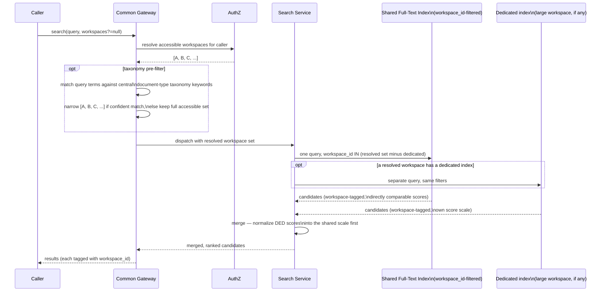

# 04 — Search and Retrieval

## 1. Single-Stage Lexical Retrieval

Per [00](00-overview.md) §2 Principle 8, every query runs **one** retrieval stage: a full-text/
lexical query against the resolved workspace(s)' Full-Text Index ([02](02-storage-and-indexing.md)
§4), ranked and returned directly. There is no embedding step, no LLM rerank, and no synthesis —
this is the Platform's entire "search and retrieval" responsibility.

```mermaid
flowchart LR
    Q[Query] --> FILT[Resolve accessible workspaces,\noptional taxonomy pre-filter \(§4\)]
    FILT --> S1[Full-Text Index query\nwith filters \(§6\)]
    S1 --> RANK[Rank by lexical score\n+ catalog-match boost \(§3\)]
    RANK --> OUT[Return ranked, cited candidates]
```

| Step | What runs | Latency profile |
|---|---|---|
| Workspace resolution | AuthZ-filtered list of accessible workspaces, optionally narrowed by a taxonomy keyword pre-filter (§4) | Negligible — table lookup |
| Retrieval | Full-text index query (with filters, §6) against the resolved workspace(s) | Low — no LLM/embedding call |
| Ranking | Lexical relevance score, boosted when a result matches the workspace's `index.md` catalog entry (§3) | Included in retrieval |

Any answer synthesis ("what does X mean, citing pages") is the responsibility of the **calling
agent**, not the Platform — see §5.

## 2. Index Scope: Curated Wiki vs. Raw Sources

By default, the Full-Text Index ([02](02-storage-and-indexing.md) §4) covers **curated wiki page
content only** — concept, entity, source, and comparison pages. This keeps the index small,
high-signal, and aligned with Karpathy's principle that the wiki (not the raw corpus) is what gets
queried.

A workspace may opt into **"deep source search"** (`SCHEMA.md` flag) which additionally indexes
chunks of raw source text. When enabled, results are tagged `source: wiki` or `source: raw`; the
ranking prefers the corresponding `source` wiki page over a raw-source chunk when both match, so
raw-source hits surface as supporting evidence alongside (not instead of) the curated page.

## 3. Lexical Candidate Retrieval & Catalog Boost

```mermaid
flowchart TB
    Q[Query text] --> LEX[Full-Text Index query\n\(resolved workspace\(s\), filters applied\)]
    LEX --> CAT{Result matches an\nindex.md catalog entry?}
    CAT -- yes --> BOOST[Apply catalog-match boost]
    CAT -- no --> RANK
    BOOST --> RANK[Rank by final lexical score]
    RANK --> TOPK[Top-K candidates:\nworkspace + page + score]
```

- Lexical retrieval handles exact terms, identifiers, acronyms, and phrase matches via the
  Full-Text Index's native ranking (e.g. BM25 / `ts_rank`).
- Each workspace's `index.md` catalog (one-line summaries per page, [01](01-architecture-and-data-model.md)
  §4) is itself indexed. A query matching a page's catalog entry gets a ranking boost for that
  page — the lexical-scoring expression of Karpathy's "LLM reads `index.md` first" pattern.
- Because there is only one retrieval path (lexical), there's no fusion of heterogeneous signal
  types — and so none of the score-comparability problems fusion exists to solve.

## 4. Federated / Cross-Workspace Search

Because content is partitioned by document type into separate workspaces, a single user query
commonly needs to search **across** workspaces (e.g. "what's our policy on X and which design doc
references it" spans *Policies* and *Engineering Docs*).



- If the caller specifies `workspaces=[...]`, the set is intersected with what they can access
  (never expanded).
- If unspecified, defaults to **all workspaces the caller can read** — this is why workspace-level
  access control ([06](06-api-mcp-and-scaling.md) §3) must be checked *before* fan-out, not
  filtered after the fact.
- **Taxonomy pre-filter (optional)**: the gateway may match query terms against the central
  document-type taxonomy's ([01](01-architecture-and-data-model.md) §3) labels/keywords to narrow
  the candidate workspace set before querying — e.g. a query containing "vacation policy" matches
  `policy.hr` keywords, narrowing to the *Policies* workspace. This is a lexical lookup against a
  small static table, not an LLM call, and is purely an optimization: if no taxonomy keyword
  matches confidently, the full accessible-workspace set is used unchanged. This is the answer to
  "how are queries routed to the right workspace" ([01](01-architecture-and-data-model.md) §2) —
  no classifier, LLM or otherwise, sits in the query path.
- **Default: a single shared Full-Text Index, `workspace_id`-filtered** ([02](02-storage-and-indexing.md)
  §4). One query with `workspace_id IN (resolved set)` returns directly-comparable scores — no
  fusion/merge step is needed for the common case.
- **Dedicated-index workspaces** (large or isolated workspaces may get their own index instance,
  [02](02-storage-and-indexing.md) §4) are queried separately. Because separate index instances can
  have different score scales, the Search Service normalizes each dedicated index's scores (e.g.
  min-max to `[0,1]` within that query's result set) before merging with the shared index's
  results — an approximation, called out explicitly so it's a deliberate tradeoff rather than a
  surprise.
- Every result is tagged with its `workspace_id` for UI grouping and citation.

## 5. Query Modes

| Mode | Behavior |
|---|---|
| `search` | Returns a ranked list of page snippets with scores, citations, and `workspace_id` tags. No synthesis. |

**Answer synthesis is not a Platform capability.** An agent that wants a synthesized answer calls
`wiki_search` (and follows up with `wiki_get_page` for full page content) via MCP
([06](06-api-mcp-and-scaling.md) §2) and synthesizes the answer itself — mirroring how Karpathy's
own LLM session reads `index.md`, drills into pages, and writes the answer. This keeps the
Platform's search/retrieval path LLM-free end-to-end ([00](00-overview.md) §2 Principle 8) while
still supporting "ask the wiki a question" as a workflow, one level up the stack.

## 6. Filtering & Facets

Retrieval accepts structured filters, applied before ranking:

- `workspace_id[]` — explicit workspace scoping (§4)
- `page_type[]` — restrict to `concept`, `entity`, `source`, `comparison`, etc.
- `tags[]` — frontmatter tag match
- `date_range` — `date` frontmatter field
- `status` — defaults to `published`; admins/API callers with elevated scope may include `draft`

## 7. Result Provenance / Citations

Every returned snippet carries:

- `workspace_id`, `page_id`/path, `page_type`, `title`
- the matched excerpt and its score
- the page's existing footnote citations to raw sources (full filename + page number for PDFs,
  per the frontmatter/citation convention in [01](01-architecture-and-data-model.md) §6)

A consuming agent that synthesizes an answer from these snippets cites the **wiki pages** it drew
from (and raw sources transitively, via those pages' own citations) — the Platform's job is to
make that provenance available, not to produce the synthesis itself.

## 8. Query Logging & Knowledge Compounding

Every `search` call is recorded in `query_log` ([02](02-storage-and-indexing.md) §5): query text
(subject to retention/privacy policy), resolved workspaces, and returned page IDs/scores. This
feeds:

- **Maintenance Advisor** orphan/low-traffic detection ([05](05-admin-backend-and-maintenance.md) §2) — pages never returned by any query are pruning candidates.
- **Optional exploration filing**: per Karpathy's pattern, when a consuming agent's own synthesis
  (§5) surfaces something not yet captured in the wiki, the agent can file that back as a new
  draft page via the normal page-creation path (`wiki_submit` / API, [03](03-ingestion-and-review-workflows.md)
  §2) — `status=draft`, `trigger=query_synthesis`. This is the agent's choice, not something the
  Platform does automatically; workspaces that don't want agent-authored drafts simply leave
  `contributor` access ungranted for those agents ([06](06-api-mcp-and-scaling.md) §3).

---
Previous: [03-ingestion-and-review-workflows.md](03-ingestion-and-review-workflows.md) · Next: [05-admin-backend-and-maintenance.md](05-admin-backend-and-maintenance.md)
