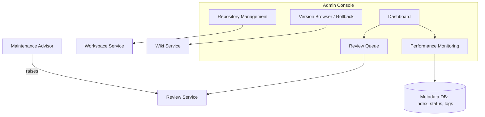
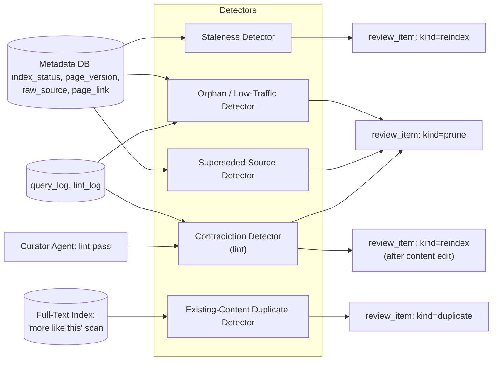

# 05 — Admin Backend and Maintenance

The Admin Console is a separate UI surface, used **only by administration staff**, focused on
keeping the Platform healthy: resolving the review queue, managing repositories/workspaces,
browsing/rolling back version history, and monitoring performance. It talks to the same Core
Services as everything else, via the Common Gateway, with an elevated access scope
([06](06-api-mcp-and-scaling.md) §3).

## 1. Review Queue (Consolidated)

A single queue lists **all** review item kinds across workspaces the admin has access to,
filterable by `workspace_id`, `kind`, `status`, and severity:

| Kind | Raised by | Defined in |
|---|---|---|
| `submission` | Ingestion Service, every new source | [03](03-ingestion-and-review-workflows.md) §5 |
| `classification` | Classifier, low-confidence routing | [03](03-ingestion-and-review-workflows.md) §3 |
| `duplicate` | Dedup check (at ingest) or Maintenance Advisor (existing content, §5 below) | [03](03-ingestion-and-review-workflows.md) §4, §5 below |
| `reindex` | Maintenance Advisor | §3 below |
| `prune` | Maintenance Advisor | §4 below |

Each item shows: subject (page/source reference), proposed action, supporting evidence (e.g.
"last queried 247 days ago, 0 inbound references"), and the available resolution actions for that
kind. Resolving an item writes to `admin_action_log` ([02](02-storage-and-indexing.md) §5).

## 2. Maintenance Advisor

A scheduled background service that runs **detectors** per workspace and turns findings into
review items. This is the mechanism behind requirements #18–#20 (reindex needs, pruning needs,
duplicate detection on existing content).

| Detector | Signal | Produces |
|---|---|---|
| **Staleness** | `index_status = stale` for longer than the workspace's threshold, or a cited `raw_source` was superseded without re-ingestion | `reindex` (or a Curator re-summarization task if a source changed) |
| **Orphan / low-traffic** | Page has zero inbound cross-references (via `page_link`, [02](02-storage-and-indexing.md) §3) **and** zero appearances in `query_log` over the workspace's lookback window | `prune` (archive candidate) |
| **Superseded-source** | `raw_source.status = superseded` and past the workspace's retention window | `prune` (source + dependent old versions) |
| **Contradiction** (lint) | Curator's periodic lint pass finds two pages making conflicting claims | `prune` (for the page that should be retired) and/or `reindex` (for the page that gets edited) |
| **Existing-content duplicate** | Periodic "more like this" scan of each workspace's own pages against the Full-Text Index ([02](02-storage-and-indexing.md) §4) finds high-similarity pairs not previously merged | `duplicate` |

**Scheduling philosophy** (popularity-tiered refresh): detector run
frequency per page/source can scale with query frequency — frequently-queried content is checked
for staleness more often than rarely-queried content, since staleness there has higher user
impact. This is a tuning detail of the scheduler, configurable per workspace, not a hard
architectural requirement.

## 3. Reindexing — Detection & Recommendations

*(Requirement: "identify the indexing/reindexing needs and propose the admin user of specific
actions.")*

A `reindex` review item includes:

- **Scope**: specific page(s), or a workspace-wide batch (e.g. "1,240 pages in `eng-docs`")
- **Reason**: `stale_content`, `taxonomy_change`, `source_updated`, `post_lint_edit`
- **Estimated cost**: page count, approximate Curator re-summarization (LLM) call volume
- **Proposed action**: `reindex now`, `schedule for off-peak`, `dismiss` (e.g. if the workspace is
  being archived anyway)

Approving queues the corresponding jobs ([01](01-architecture-and-data-model.md) §1 Async Layer),
which transition `index_status` from `stale`/`pending` to `indexing` →
`indexed` ([02](02-storage-and-indexing.md) §8). Small, single-page reindexes triggered by normal
edits do **not** go through this review path — only batched/costly reindexes do (§7 of
[02](02-storage-and-indexing.md)).

## 4. Pruning — Detection & Recommendations

*(Requirement: "identify the pruning needs and should propose the admin user of specific
actions.")*

A `prune` review item includes:

- **Subject**: a wiki page, a superseded raw source, or a range of old page versions
- **Reason**: `orphaned`, `low_traffic`, `superseded_source_retention`, `contradicted_by`
- **Evidence**: last-queried date, inbound reference count, retention age, the contradicting page (if applicable)
- **Proposed action**: `archive page` (default — reversible, see below), `delete superseded source`
  (only after retention window), `prune versions older than <version>` for a specific page

**Pruning is non-destructive by default.** "Archive" sets `wiki_page.status = archived` (excluded
from default search, retained in storage and version history, reversible by an admin). Hard
deletion is reserved for superseded raw sources past their retention window and old page versions
beyond the configured retention count — and even then follows the object-store lifecycle tiering
described in [02](02-storage-and-indexing.md) §2 (cold storage before erasure) unless a
compliance-driven erasure workflow applies ([07](07-additional-features-and-roadmap.md)).

## 5. Duplicate Review — Existing Content

In addition to ingest-time duplicate detection ([03](03-ingestion-and-review-workflows.md) §4),
the **Existing-Content Duplicate Detector** periodically runs a "more like this" similarity scan
of each workspace's own pages against the Full-Text Index ([02](02-storage-and-indexing.md) §4) for
high-similarity pairs that weren't caught at ingest time (e.g. two pages that organically converged
after several edits). These produce the same `kind=duplicate` review item
and resolution options (`merge`, `supersede`, `keep both`) as the ingest-time flow — the Admin
Console doesn't distinguish the two by UI, only by the item's recorded source (`raised_by =
ingestion | advisor`).

## 6. Versioning & Rollback Operations

The Version Browser exposes, per page:

- Full version history (`page_version` rows, [02](02-storage-and-indexing.md) §3) with
  `author`, `timestamp`, `trigger`, and `change_summary`.
- A diff view between any two versions (`diff_ref`).
- A **Rollback** action: select a prior version → creates a new version with that version's
  content, `trigger=rollback`, `restored_from_version_id` set
  ([01](01-architecture-and-data-model.md) §5). This is logged to `admin_action_log` and
  `log.md`, and marks the page's `index_status` `pending` (reindex follows normally).

`SCHEMA.md` itself is versioned the same way — workspace policy changes (taxonomy edits, dedup
thresholds, ingestion policy) are visible and revertible in the same Version Browser.

## 7. Repository Management

| Function | Description |
|---|---|
| **Workspace lifecycle** | Create, archive, or (rarely) delete workspaces; edit `SCHEMA.md`; view workspace storage bindings ([01](01-architecture-and-data-model.md) §3). |
| **Document-type taxonomy** | Add/remove/rename document types; reassign a type's target workspace (affects future routing only — existing pages are not moved automatically, but a bulk "move workspace" admin action can re-home a set of pages/sources if needed). The bulk move previews affected pages/sources (dry-run), then executes in batches with per-batch progress; a failed batch halts without rolling back completed batches. |
| **Connector management** | Configure ingestion connectors (Git repos, websites, Confluence, Notion, OpenAPI, etc. — see [03](03-ingestion-and-review-workflows.md) §2); set schedule/refresh interval, default ingestion policy (`auto`/`gated`), and credentials. Credentials are entered write-only and stored as a `credential_ref` into the deployment's secrets manager, never in the Platform's own stores; a connector authenticates as a `connector:<connector_id>` principal holding `contributor` on that one workspace, and an auth failure disables it rather than retrying — see [09](09-implementation-notes.md) §13. |
| **Raw source browser** | Browse sources per workspace, view `supersedes` chains, manually trigger re-ingestion, adjust retention. |
| **Access policy management** | Assign principals (users/groups) to workspace roles ([06](06-api-mcp-and-scaling.md) §3). |

## 8. Performance Monitoring

*(Requirement: admin UI ensures the wiki "performs well with excellent performance.")*

| Dashboard | Metrics |
|---|---|
| **Index health** | `index_status` distribution (`pending`/`indexed`/`stale`/`error`) per workspace and index type; jobs stuck beyond threshold |
| **Ingestion pipeline** | Queue depth, time-in-state for `pending_review` items (review SLA), error rate, throughput |
| **Search performance** | Search latency (p50/p95), cache hit rate ([02](02-storage-and-indexing.md) §6) |
| **Storage utilization** | Object store volume, Metadata DB size, FTS index size — per workspace, with trend |
| **Review queue health** | Open item counts and age, by kind and workspace |

Threshold breaches (e.g. error-state jobs older than N hours, review items older than the
workspace's SLA) feed the Notification Service ([07](07-additional-features-and-roadmap.md)).

---
Previous: [04-search-and-retrieval.md](04-search-and-retrieval.md) · Next: [06-api-mcp-and-scaling.md](06-api-mcp-and-scaling.md)
