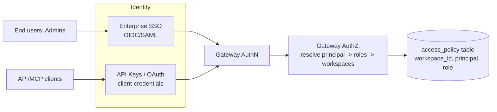
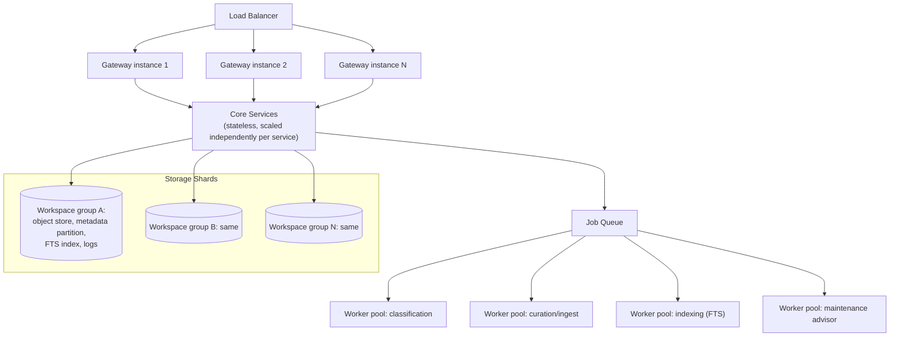

# 06 — API, MCP, and Scaling

## 1. API Surface

The API is the primary interface for apps/services and the Platform's own UIs (end-user app,
Admin Console). All operations are workspace-scoped except search (§4 of
[04](04-search-and-retrieval.md), which defaults to "all accessible workspaces").

| Resource | Operations | Caller | Notes |
|---|---|---|---|
| `workspaces` | list, get | any authenticated caller | Returns only workspaces the caller can access |
| `workspaces` | create, update, archive | admin | [05](05-admin-backend-and-maintenance.md) §7 |
| `pages` | get, list (filters: `page_type`, `tags`, `date`, `status`) | any authenticated caller | Read-only |
| `pages/{id}/versions` | list, get, diff | admin | [05](05-admin-backend-and-maintenance.md) §6 |
| `pages/{id}/rollback` | execute | admin | Creates new version per [01](01-architecture-and-data-model.md) §5 |
| `search` | `search` | any authenticated caller | [04](04-search-and-retrieval.md) §5 — single query mode, no synthesis |
| `sources` | submit (upload) | end user (and connectors) | [03](03-ingestion-and-review-workflows.md) §2 |
| `sources/{id}` | get status | submitter, admin | Pipeline state from [03](03-ingestion-and-review-workflows.md) §1 |
| `review-items` | list, get | admin | [05](05-admin-backend-and-maintenance.md) §1 |
| `review-items/{id}/resolve` | execute (action depends on `kind`) | admin | [03](03-ingestion-and-review-workflows.md) §3–5, [05](05-admin-backend-and-maintenance.md) §3–5 |
| `document-types` | list, manage | admin (manage) | [05](05-admin-backend-and-maintenance.md) §7 |
| `connectors` | list, configure | admin | [05](05-admin-backend-and-maintenance.md) §7 |

REST or GraphQL are both viable for this resource shape; the spec does not mandate one — the
contract is the resource/operation table above, not the wire format.

## 2. MCP Surface

The MCP server is a **thin protocol adapter over the same Common Gateway** — no business logic
lives in the MCP layer, mirroring how Context7's MCP package wraps its hosted API. The surface
spans both consumer operations (search, browse, submit) and — gated to `admin` — the same
review-queue and version-control operations the Admin Console uses
([05](05-admin-backend-and-maintenance.md)), so an LLM-based admin copilot can triage the queue and
act on Maintenance Advisor proposals through the same protocol a human admin uses.

| MCP tool | Maps to (API) | Caller | Notes |
|---|---|---|---|
| `wiki_search` | `search` | any authenticated caller | Single-stage lexical/catalog search ([04](04-search-and-retrieval.md) §1); returns ranked, cited page snippets — no synthesis |
| `wiki_get_page` | `pages.get` | any authenticated caller | Fetch a specific page by path/id, e.g. for an agent following a citation |
| `wiki_list_pages` | `pages.list` | any authenticated caller | Browse/filter by `page_type`, `tags`, `date`, `status` — e.g. to walk a workspace's `index.md` catalog programmatically |
| `wiki_list_workspaces` | `workspaces.list` | any authenticated caller | Discover which workspaces the caller can search or submit to |
| `wiki_submit` | `sources.submit` | end user (`contributor`), and connectors | Optional, workspace/role-gated — lets an agent submit a document on a user's behalf (still goes through the full pipeline in [03](03-ingestion-and-review-workflows.md), including the `submission` review item) |
| `wiki_get_source_status` | `sources/{id}` get status | submitter, admin | Check a submission's pipeline state ([03](03-ingestion-and-review-workflows.md) §1) — typically polled after `wiki_submit` |
| `wiki_list_review_items` | `review-items.list` | admin | List/filter the review queue ([05](05-admin-backend-and-maintenance.md) §1) by `kind`, `status`, `workspace_id` |
| `wiki_resolve_review_item` | `review-items/{id}/resolve` | admin | Execute a resolution action — action set depends on `kind` ([03](03-ingestion-and-review-workflows.md) §3–5, [05](05-admin-backend-and-maintenance.md) §3–5) |
| `wiki_get_page_versions` | `pages/{id}/versions` | admin | List version history and diffs ([05](05-admin-backend-and-maintenance.md) §6) |
| `wiki_rollback_page` | `pages/{id}/rollback` | admin | Roll back a page to a prior version ([01](01-architecture-and-data-model.md) §5) |

**Transport**: both `stdio` (for local agent/IDE integration) and streamable HTTP (for
remote/multi-user agent deployments) should be supported, following the pattern observed in
Context7's MCP server. In HTTP mode, session state (if any) is kept in a shared store reachable by
any gateway instance — **not** pinned to a single process — so MCP sessions don't constrain
horizontal scaling (§4).

**Argument normalization**: as with Context7, the MCP layer should tolerate near-miss parameter
names/aliases from LLM-generated tool calls and normalize before dispatch, rather than failing the
call outright.

## 3. Auth & Access Model

| Principal type | AuthN | Typical roles |
|---|---|---|
| End user | Enterprise SSO (OIDC/SAML) | `reader` (search, view published pages), `contributor` (also: submit documents) per workspace |
| Admin staff | Same SSO, elevated group/role | `admin` per workspace, or global admin across all workspaces |
| API/MCP client | API key or OAuth client-credentials | Scoped to specific workspaces and operations (typically `reader`, optionally `contributor`) |

`access_policy(workspace_id, principal, role)` ([02](02-storage-and-indexing.md) §3) is the single
table the gateway's AuthZ step consults. Roles are intentionally simple (`reader`, `contributor`,
`admin`) — finer-grained permissions (e.g. per-page-type) are a roadmap item
([07](07-additional-features-and-roadmap.md)) rather than a baseline requirement.

## 4. Horizontal Scaling Strategy

**Principle**: every layer in [01](01-architecture-and-data-model.md) §1 is either (a) stateless
and scales by adding instances behind a load balancer, or (b) partitioned by `workspace_id` and
scales by adding shards/instances per partition.

| Layer | Scaling mechanism |
|---|---|
| **Common Gateway** | Stateless; add instances behind a load balancer. No session affinity required if MCP session state (if used) is in a shared store. |
| **Core Services** | Stateless; each service (Workspace, Ingestion, Wiki, Search, Advisor, Review, Notification) scales independently based on its own load profile — Search Service typically needs the most instances. |
| **Async Layer** | Queue absorbs bursts; worker pools per job type scale independently. Classification and curation/ingest workers (LLM-bound, [01](01-architecture-and-data-model.md) §1) scale separately from indexing and maintenance-advisor workers (compute-bound). |
| **Object Store** | Inherently horizontally scalable (cloud object storage); no action needed beyond per-workspace prefixing ([02](02-storage-and-indexing.md) §2). |
| **Metadata DB** | Read replicas for read-heavy load; `workspace_id`-based partitioning/sharding for write scaling at large scale. A new workspace can be placed on a less-loaded shard at creation time. |
| **Full-Text Index** | Sharded by `workspace_id`; large workspaces can be given a dedicated index instance without changing the gateway contract ([02](02-storage-and-indexing.md) §4). |
| **Log/Event Store** | Append-only, time + `workspace_id` partitioned — scales naturally; old partitions age out per retention policy. |
| **Cache** | Optional; reduces read load on Metadata DB and indices for hot pages/queries ([02](02-storage-and-indexing.md) §6). |

**The workspace is the primary horizontal scaling unit.** Because workspaces are independent
(own storage bindings, own indices, own taxonomy slice), the platform scales by adding workspaces
and distributing their storage shards across infrastructure — no cross-workspace transaction or
query is required for normal operation (search fan-out in [04](04-search-and-retrieval.md) §4 is
the one cross-workspace operation, and it's parallel/read-only).

## 5. Deployment Topology

A minimal deployment consists of: a load-balanced Gateway tier, a Core Services tier (one
deployable unit per service, independently scaled), an Async Worker tier (one pool per job type),
and the Storage layer (§4). All tiers are independently scalable container/process groups behind
standard orchestration (the spec doesn't mandate a specific orchestrator — Kubernetes, ECS,
Nomad, etc. all fit this shape).

Multi-region deployment, active-active workspace replication, and disaster-recovery topology are
**not** specified here — they're flagged as roadmap considerations in
[07](07-additional-features-and-roadmap.md), since they depend on the organization's actual
latency/availability requirements.

## 6. Non-Functional Requirements (Placeholder)

The architecture above scales along the dimensions in the table; **fill in target values** before
sizing an implementation:

| Dimension | Target (TBD by org) |
|---|---|
| Peak search QPS | — |
| Peak ingestion rate (documents/hour) | — |
| Total wiki pages per workspace (typical / max) | — |
| Total raw source volume (storage) | — |
| Search latency SLA | — |
| Review-item resolution SLA (per `kind`) | — |
| Availability target | — |

---
Previous: [05-admin-backend-and-maintenance.md](05-admin-backend-and-maintenance.md) · Next: [07-additional-features-and-roadmap.md](07-additional-features-and-roadmap.md)
