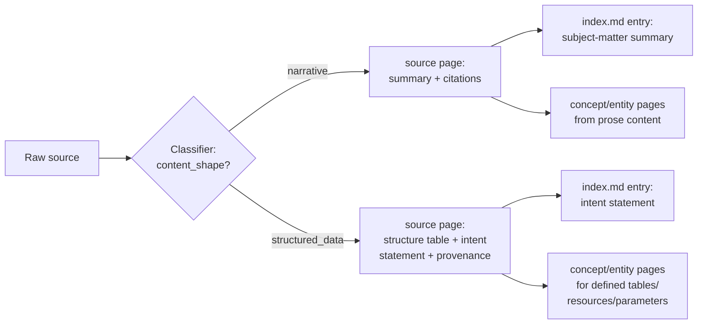
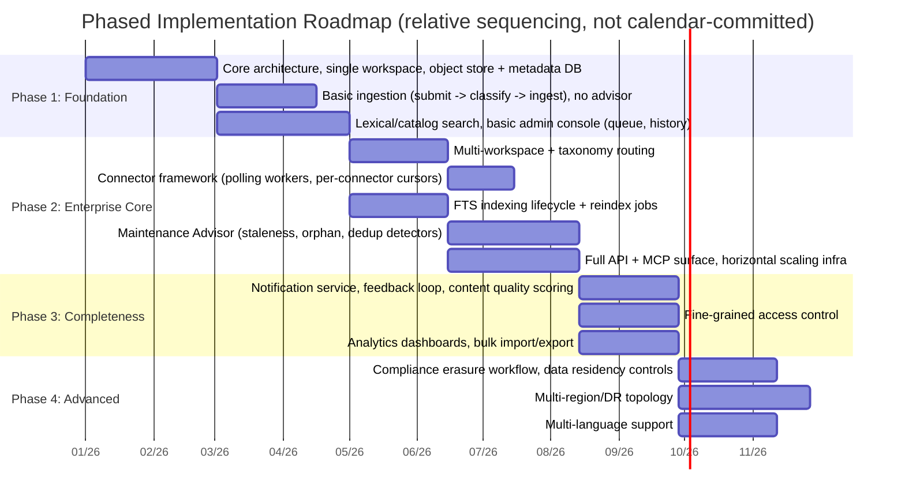

# 07 — Additional Features and Roadmap

§1 elaborates a baseline mechanism — content-shape-based ingestion treatment, referenced from
[01](01-architecture-and-data-model.md) and [03](03-ingestion-and-review-workflows.md) — in more
depth than those docs have room for. §2–6 collect features that aren't required to satisfy the
baseline requirements (docs 00–06) but round out the Platform for real enterprise operation, plus
a phased roadmap for sequencing the whole spec into an implementation plan.

## 1. Content-Shape-Based Ingestion Treatment

*(Elaborates the `content_shape` mechanism introduced in [01](01-architecture-and-data-model.md)
§4 and [03](03-ingestion-and-review-workflows.md) §3/§6, referenced from those sections as "the
full treatment.")*

Karpathy's pattern assumes raw sources are prose the Curator Agent can summarize directly.
Enterprise corpora include a large share of sources that are **mostly data or metadata** —
schemas, configs, API specs, data dictionaries — where a prose "summary" of the raw bytes would be
low-signal, and (per [00](00-overview.md) §2 Principle 8) the Platform has no vector index to fall
back on for "semantic" matching. The Classifier's `content_shape` tag (`narrative` |
`structured_data`, [03](03-ingestion-and-review-workflows.md) §3) exists so the Curator Agent
applies a different ingestion treatment for each — and so **lexical/catalog search can find
structured artifacts by what they're for, not just by filename**.

### 1.1 The two treatments

| Aspect | `narrative` source | `structured_data` source |
|---|---|---|
| Examples | Design docs, policies, meeting notes, runbooks, emails | Database schemas/DDL, OpenAPI specs, config files (YAML/JSON/TOML), data dictionaries, IaC templates, log-format definitions |
| `source` page body | Summary + key extracted points + citations — Karpathy's standard treatment | **Structure table** (fields/columns/parameters/endpoints, with type and description where available) + an **intent statement** + provenance — metadata-first, not a prose summary |
| `index.md` catalog entry | One-line summary of subject matter | One-line **intent statement**, phrased the way a user would search (e.g. "Defines retry/backoff parameters for the Payments connector"), not the filename |
| Derived concept/entity pages | Concepts/entities discussed in the prose | Entities/concepts the artifact **defines** (e.g. each major table, resource, or parameter group becomes/updates an `entity` page) |
| What makes it findable | The source's own prose already contains searchable terms | Entirely the Curator Agent's extraction — **the intent statement is the search index** for this content |

Both remain `page_type: source` with the standard frontmatter ([01](01-architecture-and-data-model.md)
§6); `content_shape` is a `raw_source` attribute ([02](02-storage-and-indexing.md) §3), not a
frontmatter field — it governs how the Curator Agent fills in the page body, not the page's type.

### 1.2 Ingestion flow

### 1.3 Extraction guidance for `structured_data` sources

During the ingest operation ([03](03-ingestion-and-review-workflows.md) §6 step 2), the Curator
Agent's task for a `structured_data` source is:

1. **Structure**: enumerate the artifact's fields/columns/parameters/endpoints as a markdown
   table — name, type, and any inline description/comment present in the source.
2. **Intent**: write a 1–3 sentence plain-language statement of *what this artifact is for* — what
   question it answers, what system or process it supports, who owns/produces/consumes it. This is
   inferred from the artifact's context (surrounding files, naming, comments), not invented.
3. **Provenance**: source system/format, the `artifact_identity`/`source_version`/
   `source_modified_at` extracted during classification ([03](03-ingestion-and-review-workflows.md)
   §3) if available, and the citation back to the raw source in object storage
   ([02](02-storage-and-indexing.md) §2).
4. **Concept/entity pages**: per [03](03-ingestion-and-review-workflows.md) §6 step 3, create/update
   an `entity` page for each major thing the artifact *defines* (a table, a top-level API resource,
   a config section) when it's significant enough to be referenced from elsewhere —
   cross-referencing the `source` page as its citation.

### 1.4 Classification guidance

`content_shape` is assigned independently of `document_type`/workspace routing
([03](03-ingestion-and-review-workflows.md) §3) — file format is a strong signal but not the sole
one (a `.md` file that's primarily a generated data dictionary is `structured_data`; a `.yaml` file
that's mostly human-written prose with embedded examples may be `narrative`). Low-confidence
`content_shape` assignment follows the same `classification` review item and admin-override path
as `document_type` ([03](03-ingestion-and-review-workflows.md) §3).

## 2. Governance & Compliance

| Feature | Description | Builds on |
|---|---|---|
| **Fine-grained access control** | Extend the baseline `reader`/`contributor`/`admin` roles ([06](06-api-mcp-and-scaling.md) §3) to per-`page_type` or per-tag permissions within a workspace (e.g. a "Legal" sub-area of the *Policies* workspace visible only to a subset of readers). | `access_policy` table |
| **PII detection at ingestion** | Classifier (or a dedicated scanner) flags sources containing PII; flagged sources get a dedicated review-item kind (`pii_review`) before ingestion proceeds. | Classifier ([03](03-ingestion-and-review-workflows.md) §3) |
| **Compliance erasure workflow** | A guarded "hard delete" path (distinct from normal archive-based pruning, [05](05-admin-backend-and-maintenance.md) §4) that removes a raw source and all derived wiki content/citations, with an audit record of the erasure request and approver — for right-to-erasure style requests. | `admin_action_log`, object-store lifecycle |
| **Legal hold** | A `legal_hold` flag on a `raw_source` or `wiki_page` that exempts it from Maintenance Advisor `prune` proposals ([05](05-admin-backend-and-maintenance.md) §4) and the compliance erasure workflow above, until an admin lifts the hold. | Maintenance Advisor, Compliance erasure workflow |
| **Data residency controls** | Per-workspace storage-binding configuration ([01](01-architecture-and-data-model.md) §3) can pin a workspace's object store / DB partition to a specific region. | Storage adapters |

## 3. Operations & Reliability

| Feature | Description | Builds on |
|---|---|---|
| **Notification Service (detailed)** | Already named as a Core Service ([01](01-architecture-and-data-model.md) §1); concretely it should: notify admins on new/aging review items and SLA breaches (§8 of [05](05-admin-backend-and-maintenance.md)), and notify submitters when their document is ingested, rejected, or merged as a duplicate. Delivery via email/chat-platform webhook. | Review Service, `admin_action_log` |
| **Rate limiting & quotas** | Per-principal and per-workspace limits on submissions, search calls, and API requests, enforced at the gateway ([01](01-architecture-and-data-model.md) §1–2). Protects shared infrastructure from a single noisy workspace or integration. | Gateway rate limiter |
| **Backup & disaster recovery** | Periodic snapshots of the Metadata DB and object store per workspace; documented point-in-time restore. Because workspaces are independently partitioned ([06](06-api-mcp-and-scaling.md) §4), restore can be scoped to a single workspace. | Storage partitioning |
| **Multi-region / DR topology** | Active-passive or active-active deployment across regions for the Gateway and Core Services tiers, with storage replication per workspace's data-residency requirements. Deferred until the org defines availability/latency targets (§6 of [06](06-api-mcp-and-scaling.md)). | Deployment topology |

## 4. Knowledge Quality & UX

| Feature | Description | Builds on |
|---|---|---|
| **Search result feedback loop** | Thumbs-up/down (or similar) on individual `search` results, recorded alongside `query_log` ([02](02-storage-and-indexing.md) §5). Persistently low-rated pages for a topic become a signal for the Maintenance Advisor's staleness/contradiction detectors ([05](05-admin-backend-and-maintenance.md) §2), and this feedback trend is also the platform's primary relevance-regression signal for ranking/boosting changes ([04](04-search-and-retrieval.md) §3–4). | `query_log`, Maintenance Advisor |
| **Content quality scoring** | During ingest/lint, the Curator Agent scores pages on citation density, cross-reference completeness, and freshness. Surfaced in the Admin Console as a sortable column, and used by the Advisor to prioritize lint/reindex work. | Curator Agent lint pass |
| **Multi-language support** | Per-workspace primary language plus optional translated page variants; the Full-Text Index applies language-specific analyzers/tokenization per page language, with cross-language retrieval (query in one language, match a page in another) as a stretch goal. | Full-Text Index (per-language analyzers), Classifier (language detection) |
| **Cross-workspace knowledge graph view** | Admin-facing visualization of cross-workspace links (built from the `page_link` reference graph maintained on every page write — [02](02-storage-and-indexing.md) §3) — helps admins spot taxonomy/workspace boundaries that don't match how content actually references itself. | Reference graph, Metadata DB |

## 5. Platform Operations

| Feature | Description | Builds on |
|---|---|---|
| **Bulk import/export** | Admin tooling to seed a new workspace from an existing document repository (bulk submission, bypassing per-document review-item noise but still subject to classification/dedup), and to export a workspace's wiki + sources for migration/backup. | Ingestion pipeline ([03](03-ingestion-and-review-workflows.md)) |
| **Workspace templates** | Predefined `SCHEMA.md` templates for common document-type categories (e.g. "Policy workspace", "Engineering docs workspace") to bootstrap new workspaces with sensible taxonomy/thresholds. | `SCHEMA.md` ([01](01-architecture-and-data-model.md) §7) |

## 6. Roadmap

| Phase | Goal | Exit criteria |
|---|---|---|
| **1 — Foundation** | Prove the Karpathy-pattern core works at all: one workspace, ingest → curated pages, basic search, admins can view review queue and page history. | A single workspace can ingest documents, produce concept/entity pages, and answer search queries with citations. |
| **2 — Enterprise Core** | Everything that makes this "enterprise": multi-workspace routing, common gateway, full storage/indexing lifecycle, Maintenance Advisor, API+MCP, horizontal scaling. | All requirements in [00](00-overview.md) §7's traceability table are met. |
| **3 — Completeness** | Operational maturity: notifications, feedback-driven quality signals, fine-grained access, analytics. | Admin staff can run the Platform without manual intervention outside the review queue. |
| **4 — Advanced** | Compliance, multi-region, multi-language — pursued based on actual organizational need. | Driven by org-specific requirements, not a fixed timeline. |

---
Previous: [06-api-mcp-and-scaling.md](06-api-mcp-and-scaling.md) · Next: [08-implementation-stack.md](08-implementation-stack.md) · Back to: [00-overview.md](00-overview.md)
